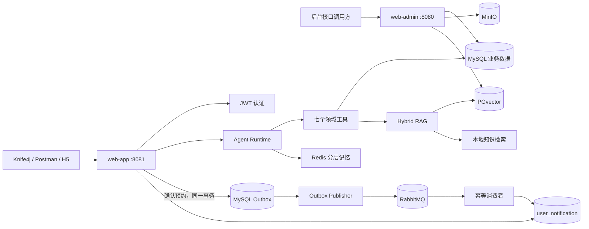

# 尚庭公寓 · 智能租房 Agent

这是一个以真实公寓租赁业务为底座、将 Java 后端与 Agent、RAG、分层记忆和 RabbitMQ 可靠消息链路结合起来的完整项目。

项目不是单独包装一次大模型调用，而是把“自然语言找房 → 查询真实房源 → 引用租赁知识 → 计算入住成本 → 生成预约草稿 → 用户显式确认 → 异步投递 → 站内通知与状态查询”串成了可测试、可降级、可追踪的业务闭环。

> 当前重点是后端能力。前端源码仍保留用于展示，但后端可以只依赖 Docker 启动，并通过 Knife4j、Postman、Apifox 或 `curl` 独立调试。

## 项目亮点

- **完整租赁业务**：后台管理、公寓与房间管理、用户认证、找房、看房预约、租约、浏览历史等传统 Java 业务模块。
- **显式 Agent Runtime**：基于 Spring AI `ToolCallingManager` 管理模型决策、工具执行、Observation 回填和多步循环，而不是把业务控制权交给模型。
- **七个受控领域工具**：覆盖房源搜索、房间详情、入住成本、租赁知识、预约草稿、预约状态和站内通知；按 `READ` / `PREPARE` 权限分级。
- **混合 RAG**：PGvector 语义检索与本地词法检索并行，使用 Query Rewrite、RRF 融合、分类加权、稳定 `chunkId` 和结构化引用提升可解释性。
- **分层上下文记忆**：Redis 保存结构化状态、历史摘要和最近消息；旧轮次被压缩而不是直接丢弃，模型不可用或 Redis 异常时仍能安全降级。
- **安全写操作**：Agent 只能生成 10 分钟有效的预约草稿，正式写入必须由已登录用户调用确认接口，避免模型误操作。
- **可靠 MQ 闭环**：预约、幂等记录和 Outbox 在同一 MySQL 事务提交；后台发布器通过 RabbitMQ Confirm/Return、重试与认领代数完成至少一次投递，消费者通过唯一键实现业务幂等。
- **可度量质量**：提供 30 条版本化 RAG 回归样本、HitRate@K/MRR/拒答准确率/同义问题一致性指标，以及 Agent、权限、超时、SSE、预约和 Outbox 自动化测试。

## 系统架构



一次 Agent 请求的核心路径：

1. JWT 拦截器取得可信 `userId`，服务端校验 `conversationId` 和输入长度。
2. 从 Redis 恢复结构化偏好、历史摘要和最近消息，构造受长度限制的上下文。
3. Runtime 识别任务目标，调用模型决定是否使用白名单工具。
4. 工具只从可信上下文读取用户身份；房源与预约结果以 MySQL 为业务真值。
5. RAG 返回带文档名、分类、章节、版本和分数的引用，而不是不可追溯文本。
6. 服务端以统一 SSE 事件输出回答、推荐、引用、脱敏轨迹和下一步动作。
7. 涉及预约时只产生 Redis 草稿；显式确认后才在事务中写入预约、幂等记录和 Outbox。
8. RabbitMQ 消费者落库站内通知，接口和 Agent 工具都可以查询最终业务状态。

## 技术栈

| 分类 | 技术 |
| --- | --- |
| Java 后端 | Java 21、Spring Boot 3.4.1、Spring MVC、Spring WebFlux、MyBatis-Plus 3.5.9 |
| Agent / RAG | Spring AI 1.0.0、Tool Calling、PGvector、Apache Tika、Hybrid Search、RRF |
| 数据与中间件 | MySQL 8.4、Redis 7.4、RabbitMQ 3.13、PostgreSQL 16 + PGvector、MinIO |
| 可靠性 | Transactional Outbox、Publisher Confirm/Return、消费幂等、Flyway |
| 接口与测试 | Knife4j 4.5.0、Springdoc 2.8.9、JUnit 5、Mockito、MockMvc、Testcontainers |
| 工程化 | Maven 多模块、Docker、Docker Compose、PowerShell smoke 脚本 |

Knife4j 是项目唯一的接口文档 UI。Springdoc 只是 Knife4j 依赖的 OpenAPI 文档引擎，项目没有并行维护第二套 Swagger 页面。

## 目录结构

```text
.
├── common/                         # 公共配置、工具类、RAG/PG 数据源、MQ 与 Outbox 基础设施
├── model/                          # MySQL 实体、枚举和共享数据模型
├── web/
│   ├── web-admin/                  # 管理端 API：房源、租约、用户、知识库入库与索引
│   └── web-app/                    # 用户端 API：认证、Agent、预约闭环、通知查询
├── db/
│   ├── ai-rental-agent/            # AI 知识文档元数据表说明
│   └── pgvector/                   # PGvector 初始化脚本
├── docker/minio/                   # MinIO 初始化脚本
├── frontend/rent-house-h5/         # 可选 H5；后端调试不依赖它
├── scripts/                        # Compose 健康检查与 Agent 闭环 smoke 脚本
├── docs/ai-rental-agent/           # 最终架构、API、面试、RAG、MQ 与验收文档
├── compose.yaml                    # 完整本地编排
├── Dockerfile                      # Java 模块多阶段构建
├── .env.example                    # 脱敏环境变量模板
└── pom.xml                         # Maven 父工程
```

Java 模块保持标准 Maven 结构，没有为了“看起来更整齐”移动包路径；这样可以避免破坏依赖关系、Mapper 扫描和历史提交。

## 迭代路线

| 阶段 | 主要改造 | 解决的问题 |
| --- | --- | --- |
| 1. 业务底座 | 公寓、房间、用户、预约、租约、后台管理 | 建立可被 Agent 调用的真实业务能力 |
| 2. 工程升级 | Java 21、Spring Boot 3.4.1、虚拟线程、依赖兼容 | 统一现代 Java 工程底座 |
| 3. RAG | 文档解析、结构化切片、PGvector、本地降级、引用 | 回答租赁规则时有知识依据 |
| 4. Agent | 显式循环、七个工具、权限、预算、超时、轨迹 | 从聊天接口升级为受控任务执行器 |
| 5. 预约闭环 | Redis 草稿、二次确认、用户绑定、SHA-256 幂等 | 防止模型直接执行高风险写操作 |
| 6. MQ 闭环 | Transactional Outbox、RabbitMQ、站内通知、DLQ | 处理数据库提交与消息发送的一致性问题 |
| 7. 质量闭环 | 分层记忆、查询改写、RRF、30 条评测集、诊断接口 | 避免粗暴截断上下文，并让 RAG 效果可度量 |

每个阶段的代码落点、事务边界、失败场景和面试追问详见[升级改造全解与面试手册](docs/ai-rental-agent/agent-rag-mq-interview-handbook.md)。

## 仅使用 Docker 启动后端

### 1. 准备配置

本机只需要安装并启动 Docker Desktop。首次运行时复制配置模板：

```powershell
Copy-Item .env.example .env
```

在 `.env` 中填写自己的模型配置：

```dotenv
AI_CHAT_BASE_URL=https://your-chat-provider.example/v1
AI_CHAT_API_KEY=your-chat-key
AI_CHAT_MODEL=your-chat-model

AI_EMBED_BASE_URL=https://your-embedding-provider.example/v1
AI_EMBED_API_KEY=your-embedding-key
AI_EMBED_MODEL=your-embedding-model
AI_EMBED_DIM=1024
```

- `.env` 已被 Git 忽略，禁止提交真实 Key。
- `AI_EMBED_DIM` 必须与 Embedding 模型的实际维度一致。
- 没有模型 Key 时后端仍可启动，并使用本地规则和本地知识降级；这适合验证业务闭环，但不代表真实模型效果。

### 2. 启动两个后端服务

```powershell
docker compose up -d --build web-admin web-app
docker compose ps
```

Compose 会自动拉起 MySQL、Redis、RabbitMQ、PGvector、MinIO 和初始化任务，不需要在 Windows 单独安装 Java、Maven 或这些中间件。

| 服务 | 地址 | 说明 |
| --- | --- | --- |
| App Knife4j | <http://127.0.0.1:8081/doc.html> | 登录、找房、Agent、预约与通知接口 |
| Admin Knife4j | <http://127.0.0.1:8080/doc.html> | 管理端与 AI 知识库接口 |
| App Health | <http://127.0.0.1:8081/actuator/health> | 用户端健康检查 |
| Admin Health | <http://127.0.0.1:8080/actuator/health> | 管理端健康检查 |
| RabbitMQ | <http://127.0.0.1:15672> | 管理控制台，账号取自 `.env` |
| MinIO | <http://127.0.0.1:9001> | 对象存储控制台，账号取自 `.env` |

Knife4j 左上角下拉框用于切换分组：App 登录接口在“登录信息”，Agent 接口在“AI智能租房”。登录后把返回的 JWT 放到请求头 `access-token` 中。

Docker 演示配置默认支持：

```text
手机号：13800000000
验证码：888888
```

固定验证码只用于本地演示，生产环境必须设置 `DEMO_LOGIN_ENABLED=false`。

### 3. 验证服务

```powershell
.\scripts\verify-compose.ps1
.\scripts\smoke-rental-agent.ps1
```

`verify-compose.ps1` 默认只检查基础设施和两个后端；如果同时启动了 H5，可使用 `.\scripts\verify-compose.ps1 -IncludeFrontend` 增加前端检查。`smoke-rental-agent.ps1` 会执行登录、SSE 对话、预约草稿、确认、幂等重放和结果查询。

停止服务：

```powershell
docker compose down
```

不要随意执行 `docker compose down --volumes`，它会删除本地 MySQL、Redis、RabbitMQ、PGvector 和 MinIO 数据卷。

## 推荐测试路径

1. 打开 App Knife4j，在左上角切换到“登录信息”，调用 `POST /app/login`。
2. 保存响应 `data` 中的 JWT，在后续请求头加入 `access-token`。
3. 切换到“AI智能租房”，先调用 `GET /app/ai/rag/search` 查看改写查询、检索模式、分数和引用。
4. 使用 Postman、Apifox 或 `curl.exe -N` 调用 `POST /app/ai/chat`，观察 `meta/message/recommendations/citations/trajectory/done` SSE 事件。
5. 调用 `/app/ai/appointments/draft` 生成草稿，再调用 `/confirm` 明确确认。
6. 通过预约状态和通知接口检查 `PENDING → PUBLISHED → DELIVERED`。其中 `PUBLISHED` 只表示 Broker 已确认接收，不等于用户已读。

完整请求体、响应字段和注意事项见 [API 文档](docs/ai-rental-agent/api.md)。

## 自动化验证

如果本机没有 JDK，可以直接在 Maven + JDK 21 容器中执行非集成测试：

```powershell
docker run --rm `
  -v "${PWD}:/workspace" `
  -w /workspace `
  maven:3.9.9-eclipse-temurin-21 `
  mvn -B -ntp -pl web/web-app,web/web-admin -am `
  '-Dtest=*Test,!ScheduledTasksTest' `
  '-Dsurefire.failIfNoSpecifiedTests=false' test
```

当前已验证的非集成回归：

- `web-app`：92 项测试通过。
- `web-admin`：4 项测试通过。
- Maven 六模块 reactor 编译通过。
- 30 条 LOCAL RAG 基线：`HitRate@3=1.0`、`MRR=1.0`、拒答准确率 `1.0`、同义问题一致性 `1.0`。

RAG 数字只代表当前小规模本地知识回归集，用于防止代码退化；不能表述为真实 PGvector、线上模型或大规模生产效果。Testcontainers `*IT`、真实模型调用和生产压测不包含在上述 96 项测试中。详见[最终验证记录](docs/ai-rental-agent/verification.md)。

## 文档导航

- [文档总索引](docs/ai-rental-agent/README.md)：不同阅读目标对应哪份文档。
- [升级改造全解与面试手册](docs/ai-rental-agent/agent-rag-mq-interview-handbook.md)：整体架构、每轮迭代、代码实现、故障推演和面试题。
- [API 文档](docs/ai-rental-agent/api.md)：认证、SSE、RAG、预约和通知接口。
- [分层记忆与 RAG 评测](docs/ai-rental-agent/context-memory-and-rag-evaluation.md)：压缩上下文、混合检索和指标设计。
- [Agent 与 MQ 闭环](docs/ai-rental-agent/mq-closed-loop.md)：状态语义、可靠性、部署风险和重放。
- [简历素材](docs/ai-rental-agent/resume.md)：可直接改写的项目描述和能力边界。
- [最终验证记录](docs/ai-rental-agent/verification.md)：已验证、未验证和不能过度宣称的内容。

## 能力边界

- 当前实现适合学习、作品集和面试演示，不声称已经生产落地或经过大规模并发验证。
- Outbox + 消费幂等实现的是“至少一次投递 + 业务效果幂等”，不是端到端 exactly-once。
- `DELIVERED` 表示站内通知已落库，不表示短信、邮件送达或用户已读。
- 模型降级路径保证接口可演示，不等于规则引擎具备完整自然语言理解能力。
- 条带锁只约束单 JVM 内的同会话并发，多实例部署仍需 Redis Lua/CAS 或分布式锁。
- PGvector 的真实效果必须在录入真实知识、确认 Embedding 维度并运行在线评测后单独报告。

## 项目来源

项目的传统租赁业务底座源于尚硅谷“尚庭公寓”学习项目，并在此基础上完成 Java 21 / Spring Boot 3.4 升级以及 Agent、RAG、分层记忆、预约安全协议、Transactional Outbox 和 MQ 通知闭环改造。
