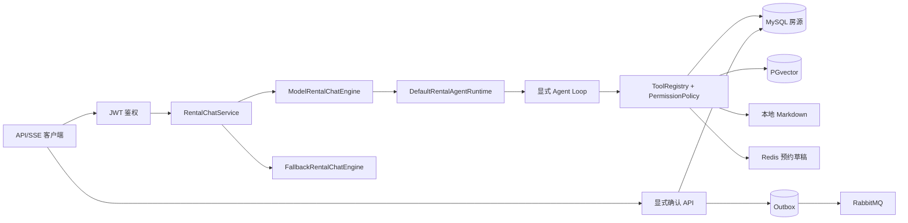

# 27公寓 Agent Harness 全链路详解

> 适用分支：`agentRag`
>
> 目标：不打开代码，也能讲清楚“业务 + Agent + RAG + 安全写入”的完整实现。
>
> 定位：面试可运行 Demo，不宣称生产级高可用。

## 1. 一句话说明项目

我在原有公寓租赁业务上实现了一个受控的租房 Agent：大模型负责理解目标、选择工具和组织答案，MySQL 提供实时房源真值，PGvector 与本地 Markdown 提供可引用的租房知识；预约采用 Redis 草稿加显式确认，确认时通过行锁、幂等记录和 Transactional Outbox 完成可靠写入。模型不可用时，系统切换到规则引擎，仍能完成找房、知识问答和预约 API 闭环。

## 2. 为什么不是普通聊天机器人

普通聊天机器人通常只有“问题 -> 模型 -> 文本”。这个项目多了四层约束：

1. 房源价格和状态必须来自 MySQL，模型不能编造。
2. 押金、付款、预约、维修、退租规则必须来自 RAG，并返回引用。
3. Agent 只能执行白名单工具，写操作默认拒绝。
4. 正式预约必须由用户调用确认 API，模型没有直接写库权限。

因此，模型负责推理和编排，Java 业务服务负责事实、权限、事务和一致性。

## 3. 总体架构



## 4. 一次 Agent 请求如何执行

以“预算 2500 元，押金怎么退”为例：

1. JWT 拦截器解析 `access-token`，得到可信 `userId`。
2. `RentalChatService` 校验消息和会话 ID，并按 `userId + conversationId` 读取有限历史。
3. 如果 `ChatModel` 可用，进入 MODEL 路径；否则进入 FALLBACK 路径。
4. MODEL 路径创建 `AgentContext`，包含用户、会话、消息、历史、目标和最大步数。
5. 模型判断需要哪些事实。混合问题通常会请求房源工具和知识工具。
6. Runtime 先校验工具名、权限、重复次数和总步数，再执行工具。
7. 工具结果作为 observation 加入对话历史，再交给模型组织最终回答。
8. 服务端从结构化 observation 生成推荐房源、引用和建议动作，不解析模型自由文本。
9. 通过 SSE 返回 `meta/message/recommendations/citations/trajectory/done`。
10. 模型或工具异常时，聊天编排层只输出一套 FALLBACK 结果，并保存本轮历史。

## 5. Agent Context 和目标识别

`AgentContext` 固化了运行时边界：

| 字段 | 作用 |
| --- | --- |
| `userId` | 由 JWT 得到，供草稿工具绑定用户 |
| `conversationId` | 隔离同一用户的不同会话 |
| `message` | 本轮原始问题 |
| `history` | Redis 中最近若干轮摘要 |
| `goal` | 找房、问政策、组合问题或准备预约 |
| `maxSteps` | 本轮最多允许的模型循环次数 |

目标识别只用于帮助模型聚焦。房源是否可租、价格多少、能否预约仍由业务工具重新查询。

## 6. 显式 Agent Loop

本项目关闭 Spring AI 的内部自动工具执行，使用 `ToolCallingManager` 自己控制循环：

```text
创建 Prompt 和 ToolCallingChatOptions
for step in 1..maxSteps:
    调用模型（受整轮 deadline 限制）
    记录模型轨迹
    如果没有 tool call:
        返回最终答案和 observations
    校验工具名、权限和同名调用次数
    执行工具（每个工具有独立 timeout）
    记录结构化 observation 和工具轨迹
    把工具结果追加到 conversation history
超过上限 -> STEP_LIMIT -> 聊天层切到 fallback
```

显式循环的价值是可控、可测试、可审计。未知工具、越权写工具、超时、死循环都能得到确定错误，而不是完全交给模型 SDK 的默认行为。

## 7. 五个领域工具

| 工具 | 权限 | 数据源 | 结果 |
| --- | --- | --- | --- |
| `search_available_rooms` | READ | MySQL | 已发布真实房源，最多 5 条 |
| `get_room_detail` | READ | MySQL | 房间、公寓地址和付款选项 |
| `calculate_move_in_cost` | READ | MySQL + BigDecimal | 首期租金、押金和总额估算 |
| `search_rental_knowledge` | READ | PGvector + Markdown | 排序后的可追溯引用 |
| `create_appointment_draft` | PREPARE | MySQL + Redis | 10 分钟草稿和确认 token |

`confirm_appointment` 没有注册为 Agent 工具。即使模型生成这个工具名，Registry 也会以 `UNKNOWN_TOOL` 拒绝。

## 8. 工具权限与执行保护

权限分三类：

- `READ`：只读查询，可以执行。
- `PREPARE`：只准备临时状态，要求已登录用户，不产生正式预约。
- `WRITE`：Agent 一律拒绝。

运行时还有四层保护：白名单、同名工具默认最多 3 次、整轮默认最多 6 个模型步骤、整轮 15 秒和单工具 3 秒超时。超时任务由虚拟线程执行器中断等待。

## 9. Observation 与结构化输出

模型文本是不稳定的，不能从一句“我找到 A101”反向猜房源。每个工具执行后会把 Java 返回对象记录成 `AgentObservation`。

`ModelRentalChatEngine` 只从 observation 生成：

- 房源工具结果 -> `recommendations`
- 知识工具结果 -> `citations`
- 草稿工具结果 -> `suggestedAction=CONFIRM_APPOINTMENT`

这样客户端依赖稳定 DTO，而不是依赖某个模型的自然语言或原始 tool call JSON。

## 10. 可解释轨迹

每次模型和工具执行都会生成单调递增的 `AgentStep`：

```json
{
  "step": 2,
  "model": null,
  "tool": "search_available_rooms",
  "status": "SUCCESS",
  "elapsedMs": 18,
  "resultCount": 3,
  "errorType": null
}
```

轨迹不保存完整 Prompt、API Key 或手机号。它用于说明模型选了什么工具、是否成功、耗时和结果数量。

## 11. RAG 链路

### 11.1 入库

Admin 文档先按 Markdown 标题切分，超长章节再递归切分。每个 chunk 使用稳定 ID，并保存 `docId/documentName/category/chapter/section/source/version/effectiveDate/checksum`。重复索引同一文档时只替换该 `docId` 的向量，避免误删其它知识。

### 11.2 检索

1. Query Rewriter 识别 DEPOSIT、PAYMENT、APPOINTMENT、REPAIR、CHECKOUT 等分类。
2. 在原问题后追加少量领域词，例如押金问题补充“退还条件、费用结算”。
3. PGvector 召回时排除 `namespace=rooms`，避免把房源描述当政策知识。
4. 同时从本地 Markdown 做关键词召回。
5. 按 `chunkId` 去重。
6. 使用“向量分 + 分类匹配 + 关键词覆盖”进行可解释 rerank。
7. 返回章节、来源、版本、摘要和分数。

向量服务失败时只降级检索来源，业务 API 不崩溃，返回模式标为 `LOCAL`。

## 12. MODEL 和 FALLBACK

MODEL 路径使用 Spring AI 的 `ChatModel + ToolCallingManager`。模型名称来自配置，可设置 primary 和 fallback model，不需要修改业务代码。

FALLBACK 路径不调用模型：正则提取预算/城市/区域，调用同一个 MySQL 房源能力和 `RentalKnowledgeService`，然后返回与 MODEL 相同的 SSE 外壳。两种模式的区别只放在 `meta.mode/provider`，客户端业务处理不分叉。

## 13. 预约为什么分两步

Agent 可以生成草稿，但草稿只保存在 Redis：

```text
ai:appointment:draft:{userId}:{token}
TTL = 10 分钟
```

草稿阶段校验房间、发布状态、未来预约时间、姓名、手机号和备注长度，不写 `view_appointment`。用户随后调用 `POST /app/ai/appointments/confirm`，请求只带 token，不再次提交可篡改的房源和联系人字段。

## 14. 确认事务与幂等

确认阶段的顺序是：

1. 对 token 做 SHA-256，先查幂等表；存在则返回原 `appointmentId`。
2. 用 Redis `SET NX` 抢占该用户该 token 的处理权。
3. 检查草稿 `userId` 等于当前登录用户。
4. 在事务中 `SELECT ... FOR UPDATE` 锁定房源。
5. 再次检查房源已发布、无生效租约、公寓归属未变化。
6. 检查当前用户没有同房间的待看房预约。
7. 同一 MySQL 事务写入预约、幂等记录和 Outbox。
8. 事务成功后尽力清理 Redis；清理失败不能把已提交预约返回成失败。

行锁解决并发检查窗口，幂等表解决 token 重放，唯一索引是数据库最后防线。

## 15. Transactional Outbox

直接“先写 MySQL，再发 RabbitMQ”存在故障窗口。项目改为：

```text
同一事务：appointment + idempotency + outbox(PENDING)
事务提交后：定时任务 claim PENDING -> RabbitMQ publisher confirm
成功：PUBLISHED
失败：指数退避后重试
达到上限：DEAD，保留错误便于排查
```

因此 MQ 暂时不可用不会回滚已经成功的预约，也不会静默丢失事件。

## 16. 稳定 SSE 协议

```text
meta -> message -> recommendations -> citations -> trajectory(可选) -> done
```

`meta` 提供模式、会话、模型/规则提供者和 traceId；`done` 带同一 traceId 与下一步建议。当前 MODEL 是完成 Agent 循环后分事件发送，不是逐 token 首字实时流式。面试时应说“使用 SSE 结构化传输”，不要夸大成实时 token streaming。

## 17. 已验证与未验证

已验证：Agent Loop、工具白名单与权限、步数/次数/超时、结构化 observation、混合检索与本地降级、草稿隔离、确认二次校验、幂等、Outbox 重试、JWT + SSE API 契约。

本轮未验证：Docker/Testcontainers 并发 IT、真实 Luna 在线 tool calling、启动 Redis 后的完整 smoke。原因是本轮明确不启动 Docker且本机 Redis 未监听；对应测试与脚本已经保留。

## 18. 面试时的 90 秒讲法

> 这个项目不是把大模型直接接到数据库，而是做了一个受控 Agent Runtime。请求进来后先构造 AgentContext，我关闭 Spring AI 默认的内部工具执行，用 ToolCallingManager 显式实现“模型决策、工具校验、执行、Observation 回填、继续推理”的循环。Registry 只注册五个领域工具，分 READ、PREPARE、WRITE 权限，并限制总步数、同工具次数和超时。房源真值来自 MySQL，政策知识走 PGvector 与 Markdown 混合检索，使用分类匹配和关键词覆盖做可解释 rerank，并返回引用。预约不允许模型直接落库，而是先生成绑定 userId 的 10 分钟 Redis 草稿，再由用户调用确认 API；确认事务内通过房源行锁、token 哈希幂等表和 Outbox 同时写入预约及事件。模型不可用时切换本地规则引擎，但保持同一 SSE 协议和业务闭环。

## 19. 高频追问

**为什么 Agent 不直接确认预约？**

模型输出具有概率性，聊天中的意向也不等于业务授权。写操作必须经过明确确认、身份绑定、参数复核、幂等和审计，所以确认能力不进入工具白名单。

**RAG 和 Tool Calling 有什么区别？**

RAG 查的是相对静态的政策知识并返回来源；房源工具查实时业务状态。房租和可租状态不能依赖历史向量，政策也不应该让模型凭记忆回答。

**为什么需要 Outbox？**

MySQL 和 RabbitMQ 无法共享本地事务。把事件和业务记录放在同一事务，再异步重试发送，可以保证至少留下可恢复事件。

**还有什么边界？**

这是面试 Demo，尚未完成多实例分布式限流、持久化 Inbox、在线评测平台、逐 token 背压处理和生产监控告警；这些不能描述成已实现。
