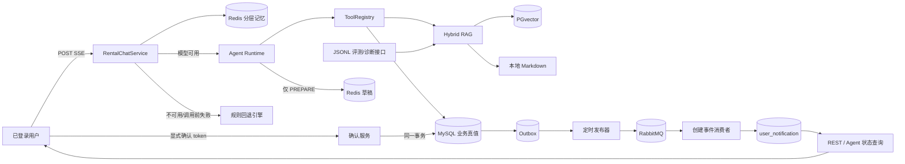
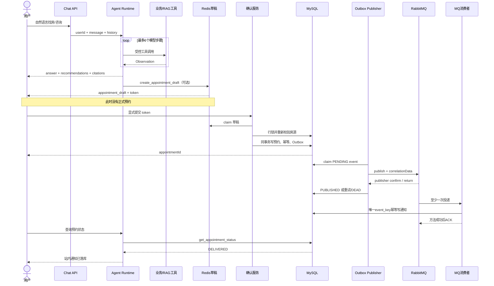
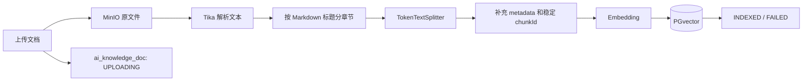

# 27 公寓智能租房 Agent：升级改造全解与面试手册

> 适用分支：`agentRag`
> 对应代码范围：`agentRag` 分支，包含 `febf895` 及后续“分层记忆 + RRF + RAG 评测”升级
> 文档定位：面向项目作者的后端源码导读、设计说明与面试答辩材料
> 当前技术边界：Spring AI 1.0.0；本阶段没有引入 MCP，也没有升级 Spring AI；不讨论前端实现
> 最后核对：2026-09-09

---

## 阅读导航

- 第 0～2 节：先掌握项目故事、改造动机和六次迭代。
- 第 3～5 节：理解技术栈、Java 后端分层、数据域和总体架构。
- 第 6～8 节：理解一次请求、Agent 主循环、工具权限与超时治理。
- 第 9～10 节：理解 RAG 入库、查询改写、RRF、评测指标和诊断接口。
- 第 11～17 节：理解预约确认、Outbox、RabbitMQ、幂等、通知和多数据源。
- 第 18～24 节：理解分层记忆、一致性、安全、测试证据、短板和后续规划。
- 第 25～30 节：用追问题库、简历写法和演示脚本完成面试准备。

建议第一次只读 0、2、5、28 节建立主线；第二次按 Java/Agent/RAG/MQ 四条专题深入；最后用第 25 节随机自测。

---

## 0. 先读这一节：面试时到底应该怎样介绍

### 0.1 一句话版本

我在原有公寓租赁系统上增加了一个受控的智能租房 Agent：大模型通过白名单工具查询真实房源和 RAG 政策知识，只能生成预约草稿，用户显式确认后才会在同一个 MySQL 事务中写入预约、幂等记录和 Outbox，随后通过 RabbitMQ 异步生成可查询的站内通知，从而形成“咨询、决策、确认、执行、反馈”的业务闭环。

### 0.2 30 秒版本

这个项目不是普通聊天机器人。我把大模型限制在“理解需求、选择工具、组织答案”这一层，房源、价格、付款方式全部来自 MySQL，政策答案来自 PGvector 与本地 Markdown 混合 RAG。Agent 有七个白名单工具、最大步骤、同工具调用上限、总超时、工具超时和执行轨迹。写操作采用 Human-in-the-loop：Agent 只能生成十分钟有效的 Redis 预约草稿，用户调用确认接口后，后端通过行锁、唯一约束和 token 哈希保证幂等，再用 Transactional Outbox 与 RabbitMQ 把预约事件可靠地转成站内通知。长对话采用“结构化状态 + 滚动摘要 + 最近原文”的分层记忆，RAG 使用加权 RRF 融合并通过版本化数据集评测；Agent 最后还能查询真实的消息处理状态，而不是凭模型猜测是否成功。

### 0.3 两分钟版本

原系统已经具备房源、公寓、用户、预约等传统业务能力，但 AI 路径最初更接近“一次检索加一次生成”，缺少明确的 Agent 循环、写操作边界和异步反馈闭环。我分阶段做了五类改造。

第一类是工程基础升级：从 Spring Boot 3.0.5 升到 3.4.1，统一使用 Java 21，升级 MyBatis-Plus 并适配 Spring Boot 3；同时引入 Spring AI 1.0.0、PGvector、Tika、WebFlux、Flyway 和可复现配置。

第二类是 RAG：Admin 上传的文档保存在 MinIO，Tika 解析后按标题结构切片，写入稳定 chunkId、分类、章节、版本和 checksum 元数据，再写进 PGvector；查询端做领域 query rewrite，同时检索向量库和本地知识，使用加权 RRF 融合不同来源的排名，最终返回引用对象而不是只返回一段不可追踪文本。

第三类是 Agent Harness：我没有依赖一个黑盒 Agent 框架，而是使用 Spring AI `ToolCallingManager` 自己管理模型—工具—观察—再推理的循环。七个工具分为 READ 和 PREPARE 权限，Agent 没有正式确认预约、支付或执行 SQL 的能力。运行时限制最大步骤、重复调用次数、总时间、单工具时间和工具结果长度，并记录 traceId 与 trajectory。

第四类是业务与 MQ 闭环：预约先以随机 token 保存到 Redis，用户再次确认后，MySQL 事务同时保存预约、token 幂等记录和 Outbox。定时发布器从 Outbox 认领事件，等待 RabbitMQ Publisher Confirm 并检查 Return；消费者收到消息后在 MySQL 中幂等保存站内通知，成功提交后才 ACK。最终 REST API 和 Agent 工具都能读取 `PENDING`、`PUBLISHED`、`DELIVERED`、`FAILED` 或 `UNKNOWN`，所以系统形成了可以验证的反馈闭环。

第五类是可持续对话和质量评测：我把固定滑动窗口升级成版本化分层记忆，结构化保存预算、城市、区域和租赁偏好，较早对话进入滚动摘要，最近对话保留原文；同时建立 30 条 JSONL 检索集和 HitRate@K、MRR、拒答准确率、同义问题一致性等指标，并提供独立 RAG 诊断接口，把“感觉回答不错”变成可重复的工程验证。

### 0.4 面试时最值得强调的三个设计点

1. **模型与业务真值分离**：模型负责决策，MySQL、PGvector 和确定性 Java 服务负责事实；不能让模型直接把自然语言变成数据库写操作。
2. **Human-in-the-loop 写入边界**：聊天里“我想看房”只生成草稿，显式确认接口才提交预约，避免模型误判、Prompt Injection 或用户误触导致写入。
3. **本地事务 + 至少一次消息 + 消费幂等**：Outbox 解决数据库提交与 MQ 发送的原子性缺口，数据库唯一键收敛重复投递；系统不虚假宣称 exactly-once。
4. **记忆和检索都可控、可评测**：记忆压缩不依赖额外模型总结，RAG 不直接混加不同量纲分数，并且明确区分 LOCAL 基线与真实向量效果。

---

## 1. 项目是什么，为什么值得改造成 Agent 项目

### 1.1 原项目的业务底座

项目本身是一个公寓租赁系统，已有用户、房间、公寓、租期、付款方式、看房预约、合同等业务。它不是为了展示 AI 而临时搭出来的空壳，因此具备一个简历项目很重要的条件：AI 能连接到真实业务数据和业务动作。

传统系统的典型流程是用户自己筛选房源、阅读规则、计算费用、填写预约。加入 Agent 后，目标不是替代所有业务代码，而是降低用户完成这些操作的认知成本：用户用自然语言表达“预算 2500，想住浦东，押一付三大概准备多少钱”，Agent 决定需要查询哪些事实，再组合成答案。

### 1.2 为什么不能只做 ChatClient 调用

一次 `prompt -> model -> text` 最多证明项目接入了大模型，无法证明它具备工程价值。真正的租房 Agent 至少要回答以下问题：

- 模型怎样拿到最新房源，而不是编造一个房间？
- 政策答案来自哪里，用户能否看到引用？
- 模型连续调用工具时，怎样避免无限循环？
- 如果模型想调用一个未授权工具，谁来拒绝？
- 用户说“帮我预约”时，是不是应该立刻写数据库？
- 数据库写成功、RabbitMQ 失败时会不会丢事件？
- RabbitMQ 重复投递会不会产生两条通知？
- 模型不可用、Redis 不可用、PGvector 不可用时系统怎样退化？
- 用户最后怎样知道预约事件真的被消费，而不是模型口头说成功？

本项目的升级就是围绕这些工程问题展开的。

---

## 2. 升级改造时间线

### 2.1 第一阶段：工程底座升级

原始父 POM 使用 Spring Boot 3.0.5。第一阶段完成了：

- Spring Boot 升级到 3.4.1。
- 编译和运行基线统一到 Java 21。
- MyBatis-Plus 升级到 3.5.9，并切换 Boot 3 starter。
- 显式引入拆分后的 `mybatis-plus-jsqlparser`。
- 配置 Java 21 虚拟线程开关。
- 敏感配置使用环境变量占位，提供 `application-template.yml`。

这一步不是为了追求版本数字，而是为后续 Agent 中大量“模型调用、工具调用、SSE 请求、异步任务”提供统一的现代运行时基础。Java 21 的虚拟线程适合本项目这类大量阻塞 I/O 的应用，但它不会自动解决数据库连接池容量、MQ 流控或外部 API 限流问题。

### 2.2 第二阶段：RAG 与可复现环境

这一阶段引入：

- Spring AI 1.0.0 BOM。
- OpenAI-compatible Chat/Embedding 接口，用于对接 GLM。
- PostgreSQL + PGvector 作为向量存储。
- Apache Tika 解析多格式文档。
- MinIO 保存原始知识文档。
- Flyway 管理结构迁移。
- Docker/配置模板和演示数据，用于复现环境。

同时实现了房源向量化、文档上传与切片、相似度检索、SSE 对话和模型不可用时的规则回退。

### 2.3 第三阶段：从“RAG 聊天”升级成显式 Agent

早期模型路径是“检索一次，然后调用模型一次”。改造后建立了明确的 Agent Harness：

```text
用户目标
  ↓
模型决定是否调用工具
  ↓
ToolRegistry 校验工具、权限、次数
  ↓
执行工具并记录 Observation
  ↓
Observation 回填给模型
  ↓
模型继续调用工具或生成最终回答
```

Agent 由后端自己管理循环，因此每一步都能限制、记录和测试，而不是把所有控制权交给模型或不可见框架。

### 2.4 第四阶段：预约安全写入与 Outbox

为了让 AI 结果进入真实业务，加入“草稿 + 显式确认”两阶段协议：

- 草稿只写 Redis，十分钟过期。
- 确认 token 使用强随机数生成，并绑定当前登录用户。
- 确认时重新检查时间和房源状态。
- 使用 MySQL 行锁降低并发状态变化风险。
- 使用 token SHA-256 哈希和唯一索引保证重复确认返回同一个预约。
- 预约、幂等记录和 Outbox 在同一事务提交。

### 2.5 第五阶段：真正把 MQ 融入 Agent 反馈链路

此前 RabbitMQ 消费者只是打印“发送短信”，再无确认地转发另一条通知消息；第二个消费者仍只打印日志。也就是说 MQ 存在，但没有产生可查询的业务结果，Agent 更不知道消息有没有处理。

最新改造将它变成：

```text
预约确认
  → Outbox PENDING
  → RabbitMQ confirm
  → Outbox PUBLISHED
  → 消费者写 user_notification
  → DELIVERED
  → REST / Agent 查询
```

这才叫“MQ 融入 Agent 闭环”：消息不是装饰，而是从用户确认到 Agent 可见结果之间的必经异步边界。

### 2.6 第六阶段：分层记忆、RRF 与版本化评测

固定保留最近 N 轮虽然简单，但会直接删除早期重要条件，例如用户第一轮给出的预算、区域，十轮之后可能完全消失。本阶段增加：

- 版本化 `ConversationMemory` 信封，包含 `schemaVersion`、`revision`、`state`、`summary` 和 `recentMessages`。
- 确定性提取预算、城市、区域、整租/合租、地铁、宠物、电梯、房源编号和联系电话。
- 最近用户修正覆盖旧状态；“预算不限”“区域不限”等显式表达可清除旧限制。
- 超过轮数或字符预算的完整对话轮次进入滚动摘要，最近原文仍用于指代和追问。
- 兼容旧 JSON 数组和更早的换行历史；Redis 故障只降级记忆，不重新执行工具。
- 同一 JVM 使用条带锁降低同会话并发读改写覆盖；跨实例 CAS 明确列为后续边界。
- 混合检索从原始分数直接加权升级为 weighted RRF，只比较各召回源内部名次。
- 增加 30 条 V1 JSONL 数据集、统一评测器和只读 `/app/ai/rag/search` 诊断接口。

### 2.7 改造前后对比

| 维度 | 改造前 | 当前实现 |
| --- | --- | --- |
| 模型调用 | 一次检索 + 一次生成 | 显式模型—工具循环 |
| 工具治理 | 单一房源查询能力 | 七工具白名单、权限、次数、超时 |
| 政策回答 | 向量/本地文本，引用信息有限 | query rewrite、结构化引用、加权 RRF、稳定排序 |
| 无关知识 | 无命中仍可能返回前两条 | 无相关证据返回空并说明不足 |
| 多轮上下文 | 固定窗口删除最早消息 | 结构化状态 + 滚动摘要 + 最近原文 |
| RAG 评测 | 10 条本地样本、结果容易误读 | 30 条版本化 JSONL、四类指标、真实模式分布 |
| 模型不可用 | 核心 AI 路径不可用或结果有限 | 本地找房、知识和消息状态规则回退 |
| 预约写入 | 传统接口或自然语言边界不清 | Agent 只生成草稿，用户显式确认 |
| 重复确认 | 依赖前端避免重复点击 | Redis claim + MySQL 唯一幂等键 |
| DB 与 MQ | 直接发送存在双写窗口 | 同事务 Outbox + 异步发布 |
| MQ 消费 | 打印短信/邮件，二次转发无确认 | 单跳幂等落库站内通知 |
| MQ 结果 | Agent 无法知道 | REST 与 Agent 查询五态结果 |
| 重复消息 | Redis 状态可能混淆处理中/完成 | 数据库唯一事件键与业务结果同事务 |
| 可观测性 | 主要看最终文本 | traceId、Observation、trajectory、消息状态 |

### 2.8 从 Git 历史看代码如何逐步落地

面试时不必背 commit，但这张表能证明项目是按风险逐层演进，而不是一次性堆砌名词：

| 代码节点 | 主要增量 | 解决的问题 |
| --- | --- | --- |
| `48520d2`～`42d627b` | PGvector 双数据源、知识文档、房源向量、Tika 入库、AI SSE 对话 | 建立最早的 RAG 能力 |
| `384b624`～`4f6f4f5` | 可复现配置、Docker、演示数据库、Docker 登录、规则降级 | 让后端能独立演示和故障降级 |
| `9b77dec`～`0641537` | 预约草稿/确认、Outbox | AI 从回答问题进入受控业务写入 |
| `e8511a2`～`f147a7c` | Agent 契约、结构化 chunk、混合知识检索 | 先定义边界，再丰富可追踪证据 |
| `f055699`～`424edcc` | 显式 Agent Harness、预约加固 | 治理工具、预算、超时、身份和重复副作用 |
| `febf895` | RabbitMQ 通知落库和状态查询 | 把 MQ 变成 Agent 可查询的业务反馈闭环 |
| 当前工作区增量 | 分层记忆、weighted RRF、30 条评测集、诊断 API | 解决长对话丢条件和 RAG 无法量化的问题 |

这里的关键方法论是：先保证传统业务和数据真值，再开放 Agent 读工具，然后通过草稿与显式确认开放有限写能力，最后补可靠消息、反馈查询、记忆与评测。每一步都可以独立测试和回滚。

---

## 3. 当前技术栈与每项技术的职责

| 技术 | 项目中的职责 | 为什么使用 | 不能解决什么 |
| --- | --- | --- | --- |
| Java 21 | 后端语言、record、虚拟线程 | 现代语法和低成本阻塞任务并发 | 不会消除外部服务瓶颈 |
| Spring Boot 3.4.1 | Web、配置、DI、事务、调度、Rabbit 集成 | 统一应用基础设施 | 不替代业务边界设计 |
| Spring AI 1.0.0 | ChatModel、Tool Calling、Document、VectorStore | 统一模型与工具抽象 | 不自动保证工具安全和业务幂等 |
| MyBatis-Plus / JDBC | 业务 CRUD、锁查询、Outbox 和通知 SQL | 与原项目兼容；复杂 SQL 可显式控制 | ORM 不会自动处理跨系统一致性 |
| MySQL | 用户、房源、预约、幂等、Outbox、通知真值 | 强事务和唯一约束 | 不能与 RabbitMQ 形成原生单事务 |
| PostgreSQL + PGvector | 知识与房源向量检索 | 支持 embedding 相似度、HNSW | 向量结果不能替代实时业务真值 |
| Redis | 分层会话记忆、预约草稿、短期 claim | TTL 与低延迟临时状态 | 不是预约最终真值；跨实例并发仍需 CAS/所有权协议 |
| RabbitMQ | 预约事件异步解耦与失败转移 | 削峰、解耦、至少一次投递 | confirm 不等于消费者处理完成 |
| Flyway | V1–V5 数据库演进 | 版本化、可审计、可复现 | 迁移仍需部署顺序和备份策略 |
| MinIO | 保存知识库原文件 | 对象存储适合非结构化文档 | 不负责文档语义检索 |
| Apache Tika | 文档文本解析 | 统一解析 PDF/Word/文本等 | 不理解业务章节含义 |
| SSE | 返回 meta、答案、推荐、引用、轨迹、草稿和状态 | 单向流式、协议简单 | 当前实现仍是缓冲后的结构化事件，不是 token 级真正流式 |
| JUnit 5 / Mockito / H2 | 单元、契约、SQL 逻辑验证 | 快速且不依赖外部服务 | H2 不能证明 MySQL 锁和真实 MQ 时序 |
| Testcontainers | 真实 MySQL/Redis/RabbitMQ 闭环测试代码 | 更接近真实依赖 | 当前完整 MQ IT 已编译但尚未实际执行 |

---

## 4. 模块和代码地图

```text
lease
├─ model
│  └─ 实体、枚举、公共数据模型
├─ common
│  ├─ RabbitMQ 拓扑与消息 DTO
│  ├─ Outbox 发布器
│  ├─ MQ 消费者
│  ├─ 站内通知存储
│  └─ AI/PGvector 共享配置
└─ web
   ├─ web-admin
   │  ├─ 知识文档上传、Tika 解析、结构化切片
   │  └─ 房源向量同步与重建
   └─ web-app
      ├─ SSE 对话入口与模型/规则引擎
      ├─ Agent Runtime、权限、工具注册
      ├─ RAG 查询、离线评测与七个业务工具
      ├─ 版本化分层会话记忆
      ├─ 预约草稿、确认、状态/通知 API
      ├─ Flyway V1–V5
      └─ 单元、契约与 Testcontainers 测试
```

建议按下面顺序读代码：

1. `AiChatController`：请求入口。
2. `RentalChatServiceImpl`：对话编排和降级。
3. `ModelRentalChatEngine`：把 Agent 结果变成 SSE。
4. `DefaultRentalAgentRuntime`：Agent 主循环。
5. `ToolRegistry`：工具白名单与守卫。
6. `ConversationMemoryService`：分层记忆、迁移、压缩和条件覆盖。
7. `HybridRentalKnowledgeService`：RRF 混合检索。
8. `RagRetrievalEvaluator` 与 `AiRagController`：离线指标和在线诊断。
9. `AppointmentDraftService`：临时草稿。
10. `AppointmentConfirmationService`：业务事务。
11. `AppointmentOutboxRepository` 与 `AppointmentOutboxPublisher`：可靠发布。
12. `AppointmentMessageConsumer` 与 `AppointmentNotificationStore`：消费幂等和最终反馈。

### 4.1 两个后端应用如何分工

项目不是一个 Controller 堆到底的单体入口，而是共享 `model/common` 的两个 Spring Boot 应用：

| 应用 | 默认端口 | 面向对象 | 主要职责 |
| --- | ---: | --- | --- |
| web-admin | 8080 | 运营/管理员 | 公寓、房间、租约等后台管理；知识文档上传、解析、索引；房源向量重建 |
| web-app | 8081 | 租客用户 | 登录、找房、浏览记录、看房预约、合同查询、AI 对话、通知与状态查询 |

后台接口受 `/admin/**` 拦截器保护并排除 `/admin/login/**`；用户接口受 `/app/**` 拦截器保护并排除 `/app/login/**`。AI 接口仍位于 `/app/**` 下，因此不是绕开原登录体系的匿名模型代理。

### 4.2 标准 Java 请求分层

传统业务请求遵循：

```text
HTTP/Knife4j
  → Controller：参数接收、身份入口、返回协议
  → Service：业务规则、事务编排
  → Mapper/MyBatis-Plus：查询与持久化
  → MySQL：业务最终真值
```

`model` 保存实体、枚举和共享数据结构；`common` 保存跨应用基础设施，例如 AI 配置、RabbitMQ 拓扑、Outbox 发布和通知存储；`web-admin/web-app` 保存各自的 Controller、Service 和应用侧 Mapper。

复杂一致性逻辑没有塞进 Controller。以预约确认为例，Controller 只取得当前用户和 confirmation token，真正的“claim 草稿、锁房间、查幂等、写预约、写 Outbox、异常恢复”由 `AppointmentConfirmationService` 编排。

### 4.3 核心业务数据域

| 数据域 | 代表表/对象 | 在 Agent 中的作用 |
| --- | --- | --- |
| 用户与权限 | `user_info`、JWT userId | 工具调用和状态查询的服务端身份 |
| 公寓与房源 | `apartment_info`、`room_info`、设施/标签关联表 | 找房、详情、费用和预约的业务真值 |
| 租约与付款 | `lease_term`、`payment_type`、房源关联表 | 入住费用的确定性计算依据 |
| 看房预约 | `view_appointment` | 用户确认后的正式业务结果 |
| AI 幂等 | `ai_appointment_idempotency` | 重复 token 返回同一 appointmentId |
| 可靠事件 | `appointment_event_outbox` | 数据库事务与 RabbitMQ 之间的持久桥梁 |
| 用户通知 | `user_notification` | MQ 消费后的可查询业务结果 |
| 知识文档 | `ai_knowledge_doc` + MinIO + PGvector | 原文状态、文件对象与向量切片 |

### 4.4 AI 为什么必须复用后端业务能力

Agent 工具不是另写一套“AI 专用数据库逻辑”。它们复用或封装现有 Service/Mapper，并继续遵守登录身份、发布状态、金额计算和事务规则。这样普通 REST 请求与自然语言入口共享同一业务真值，避免出现“页面说房间不可租，但模型仍能预约”的双套规则。

可以把 Agent 理解为新增的业务编排入口，而不是替代 Java 后端：**Java 决定什么操作合法以及如何落库，Agent 只决定当前应该调用哪个受控能力。**

---

## 5. 总体架构与真值边界



### 5.1 三类数据不能混淆

| 数据 | 真值来源 | 例子 |
| --- | --- | --- |
| 实时业务事实 | MySQL | 房间是否发布、租金、付款方式、预约状态 |
| 企业规则知识 | PGvector / 本地知识 | 押金退还、报修、退租流程 |
| 临时会话状态 | Redis | 聊天历史、十分钟预约草稿 |

向量库中的房源描述只适合语义召回，不能直接证明房间此刻仍可租。最终推荐和预约确认仍必须回查 MySQL。这是面试中很重要的一句话：**向量库负责召回候选，业务库负责最终裁决。**

### 5.2 一次完整闭环的时序



需要注意两处时间差：确认 API 返回 appointmentId 时，MQ 可能还未发布，所以状态是 PENDING；Broker confirm 后消费者可能还未提交，所以状态可能短暂为 PUBLISHED。这是异步系统正常的最终一致过程，不是错误。

---

## 6. 一次聊天请求怎样执行

### 6.1 入口与身份

`POST /app/ai/chat` 返回 `text/event-stream`。`/app/**` 由现有认证拦截器保护，登录用户保存在 `LoginUserHolder`。

`RentalChatServiceImpl.chat(request, emitter)` 在进入异步执行器之前先取得 `userId`。这样做是因为登录信息保存在 ThreadLocal 中，换线程之后不能假设它仍然存在。异步任务接收显式 `userId`，避免身份丢失或串用户。

### 6.2 输入约束

- message 不能为空。
- message 最大 4000 字符。
- conversationId 只允许 `[A-Za-z0-9_-]{1,64}`。
- 空 conversationId 使用 `default`。
- Redis key 同时包含 userId 与 conversationId，避免两个用户使用相同会话名时共享历史。

### 6.3 模型引擎与规则引擎

服务优先判断模型引擎是否可用。模型成功时输出模型结果；模型在输出任何事件前失败，调用规则回退。

模型、VectorStore 都通过条件装配和 `ObjectProvider` 取得：配置了有效模型能力时注入真实 Bean，未配置时调用方不会因为强依赖缺失而启动失败。Docker 配置还排除了不需要的默认 OpenAI/PGvector 自动配置，项目用自己的兼容路径和双数据源 Bean 控制实际连接。这是“功能可选装配”，不代表任何运行时异常都会被 Spring 自动处理；真正的调用失败仍由引擎降级逻辑处理。

模型事件先写进内存 buffer，确认整个模型引擎调用成功后才发送给 SSE sink。这避免已经给客户端发了一半模型结果，随后又追加一套 fallback 结果，造成重复 `meta`、`message` 或业务动作混乱。

这里仍有一个必须诚实说明的边界：SSE 目前输出的是一组结构化事件，不是逐 token 流式生成；`SseEmitter(0L)` 也没有应用级超时。生产化时应增加合理超时、客户端断开感知和背压/限流策略。

### 6.4 SSE 事件

| type | 作用 |
| --- | --- |
| `meta` | mode、conversationId、model/provider、traceId |
| `message` | 最终自然语言答案 |
| `recommendations` | 结构化房源推荐 |
| `citations` | 结构化知识引用 |
| `trajectory` | Agent 步骤、工具、耗时、状态 |
| `appointment_draft` | 可供用户确认的草稿与 token |
| `appointment_status` | 预约业务状态与 MQ 处理状态 |
| `notifications` | 当前用户的站内通知列表 |
| `done` | traceId 和 suggestedAction |
| `error` | 请求失败信息 |

`done.suggestedAction` 可能是 `SELECT_ROOM`、`CONFIRM_APPOINTMENT` 或 `NONE`。它只是 UI/调用方的下一步提示，不是后端业务状态。

---

## 7. Agent Harness 是怎样实现的

### 7.1 为什么叫 Harness

Harness 可以理解为“给模型套上的安全运行框架”。模型本身只产生文本或工具调用请求；后端负责决定哪些工具可见、是否允许调用、最多调用多少次、执行多久、怎样把结果反馈回模型。

### 7.2 主循环

`DefaultRentalAgentRuntime` 的核心循环可以概括为：

```java
for (step <= maxSteps) {
    response = chatModel.call(prompt);
    recordModelStep(response);
    if (!response.hasToolCalls()) return finalResult;

    toolRegistry.validate(toolCalls, context, state);
    toolResult = toolCallingManager.executeToolCalls(prompt, response);
    prompt = new Prompt(toolResult.conversationHistory(), options);
}
throw STEP_LIMIT;
```

真实代码还加入总 deadline、虚拟线程执行器、异常分类和部分结果保护。

### 7.3 为什么关闭 Spring AI 内部自动工具执行

配置使用 `internalToolExecutionEnabled(false)`。如果交给框架自动循环，应用很难在每次调用前做权限检查、次数限制和轨迹记录。关闭之后，由项目自己调用 `ToolCallingManager.executeToolCalls`，每次工具动作都经过 `ToolRegistry`。

### 7.4 AgentContext 与 AgentExecutionState

`AgentContext` 是请求上下文，包含：

- 当前 userId。
- conversationId。
- 当前消息。
- 历史消息。
- 检测到的业务目标。
- 当前请求最大步骤。

`AgentExecutionState` 是本次执行状态，包含：

- UUID traceId。
- Observation 列表。
- trajectory 列表。
- 每个工具的调用次数。
- 已使用的模型步骤数。
- 整个请求共享的 deadline。

两者通过 Spring AI `ToolContext` 传给工具。工具不接受模型提供的 userId，而是从可信上下文读取当前用户。

### 7.5 预算与超时

默认配置：

| 限制 | 默认值 | 防止的问题 |
| --- | ---: | --- |
| 最大模型步骤 | 6 | 无限 ReAct 循环和费用失控 |
| 同一工具最大调用 | 3 | 模型重复搜索或重复准备草稿 |
| 请求总超时 | 15 秒 | 模型/工具链长期占用请求 |
| 单工具超时 | 3 秒 | 某个数据库或外部工具拖死整轮 |
| 工具结果最大字符 | 8000 | 过大结果占用上下文窗口 |

工具实际超时取 `min(配置的工具超时, 请求剩余时间)`。主模型和备用模型共用同一个 deadline 与步骤状态，不能在主模型失败后重新获得一套完整预算。

Java `Future.cancel(true)` 只是中断请求，底层数据库驱动或网络库不一定能立即停止。因此面试时不能说“超时能保证撤销外部操作”；它只是资源控制手段，业务副作用仍要靠幂等和权限边界保护。

### 7.6 模型失败后的部分结果保护

如果模型还没调用工具就失败，可以切换备用模型或规则引擎。如果模型已经请求过工具，再开启一轮全新 fallback 可能重复执行工具，尤其可能重复生成预约草稿。

当前策略是：已经发生工具请求后，保留 state 中的结构化 Observation，记录 `PARTIAL` 轨迹，并返回保守说明；不重放工具链。若 Observation 中已经有草稿，SSE 仍能把草稿发给调用方，但正式预约仍未确认。

---

## 8. 七个工具分别做什么

| 工具名 | 权限 | 输入 | 真值来源 | 输出 |
| --- | --- | --- | --- | --- |
| `search_available_rooms` | READ | 城市、区、租金范围、limit | MySQL | 最多 5 个 RoomHit |
| `get_room_detail` | READ | roomId | MySQL | 房号、租金、公寓、地址、付款方式 |
| `calculate_move_in_cost` | READ | roomId、付款方案 | MySQL + 确定性计算 | 租金、押金、首期估算和免责声明 |
| `search_rental_knowledge` | READ | 问题、category、limit | PGvector + Markdown | query、mode、citations |
| `create_appointment_draft` | PREPARE | 房间、姓名、手机、时间、备注 | MySQL + Redis | token、过期时间、草稿摘要 |
| `get_appointment_status` | READ | appointmentId | MySQL | 预约与消息状态 |
| `list_my_notifications` | READ | limit | MySQL | 当前用户站内通知 |

### 8.1 READ、PREPARE、WRITE 的边界

- READ：读取或计算，不改变核心业务。
- PREPARE：可以生成短期草稿，但不能创建正式预约。
- WRITE：正式业务写入。`PermissionPolicy` 明确拒绝 Agent WRITE。

注册表中根本没有 `confirm_appointment`。即使模型输出这个名字，`ToolRegistry.validate` 也会抛出 `UNKNOWN_TOOL`。这比只在 System Prompt 写“不要确认预约”更可靠，因为 Prompt 是软约束，注册表是代码级硬约束。

### 8.2 为什么还要在 GuardedToolCallback 里再校验一次

校验发生两层：模型批量返回工具调用后先检查；真正执行 callback 时再次检查上下文和权限。这叫纵深防御。无 ToolContext 的 `call(String)` 被直接拒绝，避免其他路径绕过认证上下文调用工具。

### 8.3 费用计算为什么不用模型算

金额计算由 `MoveInCostTool` 使用 `BigDecimal` 完成。模型只负责解释结果。这样可以避免浮点误差和模型算术幻觉。计算结果还明确标注不包含水电、服务费，最终以合同为准。

---

## 9. RAG 的写入链路

### 9.1 文档从上传到向量库



### 9.2 为什么先按标题分段，再按 token 切片

只按固定长度切片可能把“押金退还条件”标题与正文切开，检索命中正文后无法告诉用户它属于哪一章。`StructuredKnowledgeChunker` 先识别 `#` 到 `######` 标题，保留 chapter/section，再在章节内使用 `TokenTextSplitter`。

默认参数：目标 800 token、最小 350 字符、小于 5 字符的块不向量化、单文档最多 10000 块。这些值是可配置工程参数，不是经过大规模线上实验得出的最优值。

### 9.3 metadata 为什么重要

每个知识 chunk 包含：

- namespace：知识空间隔离。
- docType：`doc` 或 `room`。
- docId、documentName、source：追踪原文档。
- chapter、section：展示可理解引用。
- category：DEPOSIT、PAYMENT、APPOINTMENT、REPAIR、CHECKOUT、MOVE_IN 或 GENERAL。
- version、effectiveDate：为后续版本和时效治理留字段。
- checksum：内容摘要。
- chunkId：`knowledge-{docId}-{sectionIndex}-{chunkIndex}-{checksum前12位}`。

稳定 chunkId 让相同文档重建索引后更容易定位、去重和追踪。checksum 不是权限或数字签名，只用于内容身份与诊断。

### 9.4 房源向量与知识向量为什么共库分 namespace

房源文本用于语义召回，普通文档用于政策问答。房源 metadata 使用 `namespace=rooms`，知识查询通过过滤表达式排除 rooms，避免把“月租 2500 的房间”当成付款政策引用。

房源同步由 Admin 事件监听器异步触发，也支持全量重建。房源向量存储 roomRef、roomNumber、rent、apartmentId 等字段，但实时结果仍须回查 MySQL。

---

## 10. RAG 的查询链路

### 10.1 Query Rewrite

`RentalQueryRewriter` 根据领域词识别分类，并补充同义业务词。例如：

```text
原问题：押金什么时候退？
分类：DEPOSIT
补充：押金、退还条件、费用结算
改写：押金什么时候退？ 押金 退还条件 费用结算
```

它是可解释的规则改写，不是额外调用一次大模型。因此成本低、结果稳定；缺点是覆盖范围依赖词表。

### 10.2 混合检索

`HybridRentalKnowledgeService` 做两路候选：

1. PGvector 相似度检索：`topK=max(limit*2, configuredTopK)`，阈值默认 0.75，过滤 `namespace != rooms`。
2. 本地 Markdown 关键词检索：作为没有 VectorStore 或向量调用失败时的知识兜底。

只有两路检索都实际返回候选时，结果模式才是 `HYBRID`；只有向量命中为 `VECTOR`，只有本地命中为 `LOCAL`，都不命中为 `EMPTY`。这避免了“向量接口调用成功但返回 0 条，结果仍标成 HYBRID”的错误观测。

这里所谓 HYBRID 指“dense vector + 本地 Markdown 词法候选”，不是严格意义上的 BM25 + dense vector。面试时要讲准确。

### 10.3 为什么不能直接相加分数

向量相似度与词法命中分数不是同一量纲。例如向量结果可能集中在 0.75～0.85，而词法实现可能返回固定分或命中次数。直接相加会导致某一路因为数值范围而天然占优，即使它的排序质量并不更好。

因此当前实现使用加权 Reciprocal Rank Fusion：

```text
rrfScore(document)
  = vectorWeight  / (rrfK + vectorRank)
  + lexicalWeight / (rrfK + lexicalRank)
```

默认 `rrfK=60`、`vectorWeight=1.0`、`lexicalWeight=0.8`。RRF 只使用每一路内部的名次，对不同来源的原始分数范围不敏感。随后把理论最大值归一化到 0～1；分类命中只增加默认 0.08 的小幅 boost，不代替知识证据。

### 10.4 稳定排序与去重

候选以 chunkId 为主键融合，同一候选被两路召回时累加 RRF 贡献。得分相同时再按稳定文档键排序，因此相同语料、相同参数下顺序可复现。若向量候选与本地候选内容相同但 chunkId 不同，目前仍可能作为两条结果存在，这是后续内容级去重可以继续改进的地方。

RRF 是 rank fusion，不是 Cross Encoder reranker。它解决的是多路分数不可比问题，不能像精排模型一样理解复杂的 query-document 交互。

### 10.5 无相关证据时为什么必须返回空

旧本地知识逻辑在没有匹配时返回前两条规则，这会让“明天天气怎样”也附带押金或付款引用，形成看似有引用的幻觉。现在无匹配就返回空，fallback 明确说“暂无相关政策证据”。

RAG 的原则不是“任何问题都找一段文本”，而是“有证据才回答，没证据就暴露不确定性”。

### 10.6 版本化评测怎样实现

评测集位于 `web/web-app/src/test/resources/ai/rag-evaluation-dataset.jsonl`。V1 共 30 条：24 条可回答问题、6 条无答案问题，覆盖押金、付款、预约、报修、退租和入住材料，并给同一意图准备多种口语表达。

每条样本至少包含：

```json
{
  "id": "deposit-01",
  "datasetVersion": "v1",
  "paraphraseGroup": "deposit-refund",
  "question": "退房后押金多久退？",
  "expectedCategory": "DEPOSIT",
  "answerable": true
}
```

`RagRetrievalEvaluator` 接收“样本 + 实际检索结果”，统一计算：

- `HitRate@K`：可回答问题的正确分类是否出现在前 K 条。
- `MRR`：第一个正确结果排名的倒数均值，越靠前越好。
- `abstentionAccuracy`：无答案问题是否真的返回空证据。
- `paraphraseConsistency`：同义问题 Top-K 文档集合的 Jaccard 一致性。
- `modeCounts`：LOCAL、VECTOR、HYBRID、EMPTY 的实际分布，用于识别是否真的使用了向量库。

V1 本地 Markdown 基线结果为：

```text
samples=30, answerable=24, unanswerable=6
HitRate@3=1.0, MRR=1.0
abstentionAccuracy=1.0, paraphraseConsistency=1.0
modeCounts={LOCAL=24, EMPTY=6}
```

这个 1.0 很容易被误用。它只说明“小型规则知识库在针对它构建的小型数据集上通过”，不代表 Embedding、PGvector 或生成答案是 100%。检查时向量表仍为 0 条，因此不能把 LOCAL 基线写成向量检索成绩。

### 10.7 检索诊断接口

`GET /app/ai/rag/search` 绕开大模型，直接返回 `originalQuery`、`rewrittenQuery`、`mode` 和 citations。接口受现有 `/app/**` 登录拦截器保护，可以用 Knife4j/Postman 单独判断故障属于查询改写、召回、排序还是生成阶段。

---

## 11. 预约为什么设计成两阶段

### 11.1 风险

用户说“这个房间挺好”“有空去看看”不一定是在授权系统创建正式预约；模型也可能误解、被 Prompt Injection 影响或抽取错手机号。如果工具直接写数据库，就把概率性模型放到了确定性业务的最终决策位。

### 11.2 第一阶段：创建草稿

`AppointmentDraftService` 校验：

- 必须有登录 userId、roomId。
- 联系人非空，去空格后最多 16 字。
- 手机符合中国大陆手机号格式。
- 预约时间晚于当前时间。
- 备注不超过 255 字。
- 房间存在且当前为 RELEASED。

通过后使用 `SecureRandom` 生成 32 字节随机数，再做无 padding 的 URL-safe Base64。token 熵约 256 bit，不可由 roomId 或用户信息推断。

草稿保存到：

```text
ai:appointment:draft:{userId}:{token}
```

TTL 为十分钟。返回 `AppointmentDraftResponse`，包括 token、expiresAt、房间、公寓、联系人、时间和备注。模型路径会把它作为 `appointment_draft` SSE 事件输出。

此时 **没有** 写 `view_appointment`，也没有 Outbox。

### 11.3 第二阶段：用户显式确认

用户把 token 提交到 `POST /app/ai/appointments/confirm`。确认服务先用当前 userId 和 token 查询幂等记录；如果曾经成功，直接返回相同 appointmentId，并标记 `idempotentReplay=true`。

若未成功，则在 Redis 使用 `SET NX` 取得 30 秒 claim，避免同一 token 的两个请求同时进入数据库事务。之后再次检查：

- token 对应草稿是否存在。
- 草稿 userId 是否等于当前用户。
- 预约时间此刻是否仍在未来。
- `SELECT ... FOR UPDATE` 锁定房间，并确认仍发布且公寓未变化。
- 当前用户是否已经存在同房间有效预约。

### 11.4 为什么草稿阶段检查后，确认阶段还要再检查

这是典型 TOCTOU（检查时和使用时不同）问题。用户拿到草稿后十分钟内，房间可能下架、租出或预约时间可能已经过期。草稿只是建议快照，正式写入必须以确认时的业务状态为准。

### 11.5 三层幂等

1. Redis claim：降低并发请求同时执行的概率。
2. `ai_appointment_idempotency` 唯一键 `(user_id, token_hash)`：数据库最终裁决同一 token 只能对应一条成功结果。
3. 同用户、同房间有效预约检查：阻止换 token 重复预约同一房间。

数据库只保存 token 的 SHA-256，而不保存原始 bearer token，降低数据库泄漏后的直接重放风险。SHA-256 不是密码哈希；这里输入是高熵随机 token，所以不需要像低熵用户密码那样使用 bcrypt。

### 11.6 已知锁边界

当前 Redis claim 的 value 是固定 `1`，release 直接删除 lock key，没有随机 ownership token 和 Lua compare-and-delete。如果操作超过 30 秒、锁过期后被另一请求取得，旧请求的 release 理论上可能删除新锁。最终 MySQL 唯一约束仍保护重复预约，但 Redis 锁实现不应被描述为生产级完整分布式锁；后续可改为随机 owner + Lua 或成熟锁组件。

---

## 12. Transactional Outbox 解决了什么

### 12.1 直接发送 MQ 的两个错误窗口

如果先写数据库再发 MQ：

```text
预约提交成功 → 进程崩溃 → MQ 未发送
```

预约存在，但下游永远不知道。

如果先发 MQ 再提交数据库：

```text
MQ 已发送 → 数据库回滚
```

下游处理了一个不存在的预约。

本地 MySQL 事务无法原子提交 RabbitMQ，所以需要 Outbox。

### 12.2 同一事务写三张表

确认事务内依次写：

```text
view_appointment
ai_appointment_idempotency
appointment_event_outbox
```

三者一起提交或一起回滚。只要接口返回成功，预约和待发布事件都已经在 MySQL；RabbitMQ 当时是否在线不影响预约事务的原子性。

### 12.3 Outbox 表关键字段

| 字段 | 含义 |
| --- | --- |
| aggregate_id | appointmentId |
| event_type | `APPOINTMENT_CREATED` |
| payload_json | 消息业务快照 |
| status | PENDING / PUBLISHED / DEAD |
| attempts | 认领/发送代数和累计尝试数 |
| next_attempt_at | 租约到期或下次重试时间 |
| published_at | Broker 确认时间 |
| last_error | 最后错误，截断为 500 字符 |

### 12.4 Outbox 不是消息队列

Outbox 是可靠的待发送日志，不负责高效广播、消费组、路由和背压；RabbitMQ 仍负责消息传输。两者组合使用，各自解决不同问题。

---

## 13. Outbox 如何安全认领和发布

### 13.1 多实例认领

查询使用：

```sql
SELECT ...
FROM appointment_event_outbox
WHERE status = 'PENDING' AND next_attempt_at <= ?
ORDER BY id
LIMIT 1
FOR UPDATE SKIP LOCKED;
```

`FOR UPDATE` 锁定候选行；`SKIP LOCKED` 让其他实例跳过已经被锁的事件，而不是全部阻塞。认领时 attempts 加一，并把 next_attempt_at 推迟 30 秒，形成处理租约。

当前每次只认领一条。原因是 Publisher Confirm 最多等待 10 秒；如果一次认领 20 条，后面的事件可能尚未发送，30 秒租约已经到期，被其他实例再次认领。单条认领牺牲了一些吞吐，但与当前简单租约模型更匹配。

### 13.2 fencing：为什么更新条件要带 attempts

场景：发布器 A 认领 attempts=1，卡顿超过 30 秒；发布器 B 重新认领，把 attempts 改为 2 并完成。A 恢复后如果只按 id 更新，就可能覆盖 B 的新状态。

现在完成更新条件是：

```sql
WHERE id = ? AND status = 'PENDING' AND attempts = ?
```

A 持有旧代数 1，数据库已经是 2，因此 A 的迟到更新不生效。这就是 fencing token 思想；项目复用了 attempts 作为单调代数。

### 13.3 Publisher Confirm 与 Return

发送时创建 `CorrelationData(eventId)`，等待最多十秒：

- ACK：Broker 接受发布。
- NACK：Broker 明确拒绝，抛出失败。
- Timeout/ExecutionException：确认结果不确定，按失败重试。
- ACK 但 ReturnedMessage 非空：交换机收到消息，但没有路由进目标队列，也算失败。

只有 ACK 且没有 return 才把 Outbox 标成 PUBLISHED。

### 13.4 为什么 ACK 不等于业务完成

Publisher Confirm 只证明 RabbitMQ 接收了消息，不证明消费者已经处理，更不证明短信送达。项目因此把 PUBLISHED 和 DELIVERED 分成两个状态。

### 13.5 重试

失败时最多尝试五次，退避秒数约为：2、4、8、16、32。达到上限标记 DEAD，否则保留 PENDING 并写 next_attempt_at。

这里是指数退避，没有 jitter。多个事件同时失败恢复时可能出现重试同步尖峰，后续可增加随机抖动。

---

## 14. RabbitMQ 拓扑与消费语义

### 14.1 拓扑

```text
appointment.exchange (direct)
├─ view.appointment.create → appointment.create.queue
├─ view.appointment.notify → appointment.notify.queue（兼容旧状态消息）
└─ 两个业务队列失败/过期 → dlx.exchange
                              └─ appointment.dlx → appointment.dlx.queue
```

队列和交换机都是 durable。JSON 使用共享的 `Jackson2JsonMessageConverter`；它既注入 `RabbitTemplate`，又作为 Spring Bean 让监听器工厂使用，避免生产者是 JSON、消费者却按另一种转换器解析。

### 14.2 新创建链路为什么改成单跳

旧链路：

```text
create queue → 打印短信 → 无 confirm 地发送 notify queue → 打印邮件
```

如果第一次消费成功但第二次发送丢失，原消息已 ACK，通知永久丢失；而且两端都只是日志，不构成业务结果。

新链路：

```text
create queue → user_notification 事务落库 → ACK
```

减少一个不可靠窗口。旧 `appointment.notify.queue` 保留给现有 UPDATE/CANCEL 生产者兼容，但新的 CREATE 闭环不依赖第二跳。

### 14.3 消费失败怎么处理

消费者最多同步尝试三次：

- `IllegalArgumentException` 表示非法事件或用户归属不匹配，直接抛 `AmqpRejectAndDontRequeueException`。
- 其他运行时异常允许三次尝试。
- 三次仍失败则拒绝，消息根据队列 DLX 配置进入死信队列。

项目故意不再监听并自动消费 DLQ。否则程序只打印日志后 ACK，死信会从队列消失，反而无法审计和重放。

### 14.4 当前 ACK 语义

业务方法在数据库事务提交完成后返回；默认监听容器在方法成功返回后 ACK。数据库异常会抛出，监听器不会把它当成功。

如果需要生产级精确控制，应显式配置并测试 listener acknowledgement mode、prefetch、concurrency 和事务边界，而不能仅依赖默认配置。

### 14.5 两小时 TTL 到底是什么

`appointment.create.queue` 保留两小时 message TTL。它的含义是消息在队列中等待超过两小时会进入 DLQ，不是“两小时后提醒用户”，更不会自动取消预约。面试中若把它说成延迟提醒会被追问击穿。

---

## 15. 消费幂等为什么放在 MySQL

### 15.1 至少一次意味着一定要接受重复

即使 Broker、网络和代码都正常，也可能发生：

```text
消费者写库成功 → ACK 在网络中丢失 → RabbitMQ 再投递
```

所以消费者必须能重复执行而不产生重复业务效果。

### 15.2 唯一事件键

`user_notification.event_key` 有唯一索引。CREATE 使用：

```text
appointment:{appointmentId}:CREATE
```

插入使用：

```sql
INSERT ...
ON DUPLICATE KEY UPDATE id = id;
```

重复消息变成 no-op，不覆盖正文，也不会把 read_at 重置为空。CREATE 键按业务预约而不是只按 eventId 生成，因此旧格式无 eventId 的 CREATE 和新 Outbox CREATE 也能收敛成一条通知。

### 15.3 为什么不继续只用 Redis 去重

原 Redis 去重把“正在处理”和“已经完成”都表现为无法 claim。若第一个消费者 claim 后宕机，第二个消费者可能把它当作已处理而 ACK，造成消息丢失。

数据库唯一约束与业务结果在同一事务里：只有通知真正存在，幂等效果才成立。Redis 可以作为性能优化，但不应是唯一正确性边界。

### 15.4 消费前为什么检查预约归属

消息体里的 userId 不能无条件信任。持久化前查询 `view_appointment WHERE id=? AND user_id=?`，确认预约与用户匹配，防止脏消息或构造消息给其他用户写通知。

---

## 16. 状态查询如何让 Agent 闭环

### 16.1 新增站内通知表

Flyway V5 新增 `user_notification`：

| 字段 | 用途 |
| --- | --- |
| id | 通知主键 |
| event_key | 消费幂等唯一键 |
| event_id | 对应 Outbox eventId，可空以兼容旧消息 |
| appointment_id | 关联预约 |
| user_id | 用户隔离 |
| notification_type | CREATE / UPDATE / CANCEL |
| content | 站内通知正文，最多 1000 字 |
| created_at | 通知落库时间 |
| read_at | 幂等已读时间 |

同时给 Outbox 增加 `(aggregate_id, event_type, id)` 索引，支持按预约查最新事件状态。

### 16.2 对外接口

```text
GET  /app/ai/appointments/{appointmentId}/status
GET  /app/ai/notifications?limit=20
POST /app/ai/notifications/{id}/read
```

所有查询都带当前登录 userId。不存在和越权都表现为“不存在”，避免攻击者通过响应差异枚举其他用户的预约或通知。

列表 limit 被限制在 1–50，防止模型或客户端传一个极大数字把整表拉进内存。

### 16.3 deliveryStatus 的语义

| 状态 | 判定 | 精确含义 |
| --- | --- | --- |
| PENDING | Outbox=PENDING，通知不存在 | 等待发布或正在重试 |
| PUBLISHED | Outbox=PUBLISHED，通知不存在 | Broker 已确认，未观察到消费结果 |
| DELIVERED | CREATE 通知记录存在 | 站内通知已落库 |
| FAILED | Outbox=DEAD，通知不存在 | 发布阶段重试耗尽 |
| UNKNOWN | 无通知且无对应 Outbox | 旧预约或无法判定 |

若通知已经存在，即使 Outbox 状态还是 PENDING 或后来被误标 DEAD，查询优先返回 DELIVERED。这覆盖了“消费者先落库，发布器稍后更新 PUBLISHED”的正常竞态。

DELIVERED 不表示短信、邮件、推送到达，也不表示用户已经阅读。read_at 才表示站内通知被标记已读。

### 16.4 Agent 怎样查询

Agent 新增：

- `get_appointment_status(appointmentId)`。
- `list_my_notifications(limit)`。

工具从 ToolContext 获取 userId。模型不能传 userId，因此不能用“帮我查用户 8 的通知”越权。

模型不可用时，规则引擎也识别“预约 123 的状态”“我的通知”。如果用户只给房间号，它会要求预约编号，而不会把 roomId 猜成 appointmentId。

### 16.5 请求与响应示例

创建草稿：

```http
POST /app/ai/appointments/draft
access-token: <JWT>
Content-Type: application/json

{
  "roomId": 930001,
  "name": "张三",
  "phone": "13800000000",
  "appointmentTime": "2026-09-08T10:00:00",
  "additionalInfo": "上午方便"
}
```

```json
{
  "code": 200,
  "message": "成功",
  "data": {
    "confirmationToken": "<高熵临时token>",
    "expiresAt": "2026-09-06T02:10:00Z",
    "roomId": 930001,
    "apartmentId": 920001,
    "name": "张三",
    "phone": "13800000000",
    "appointmentTime": "2026-09-08T10:00:00",
    "additionalInfo": "上午方便"
  }
}
```

确认预约：

```http
POST /app/ai/appointments/confirm
access-token: <JWT>
Content-Type: application/json

{"confirmationToken":"<草稿token>"}
```

第一次确认返回：

```json
{"code":200,"message":"成功","data":{"appointmentId":101,"idempotentReplay":false}}
```

相同 token 再次确认：

```json
{"code":200,"message":"成功","data":{"appointmentId":101,"idempotentReplay":true}}
```

查询状态：

```http
GET /app/ai/appointments/101/status
access-token: <JWT>
```

```json
{
  "code": 200,
  "message": "成功",
  "data": {
    "appointmentId": 101,
    "roomId": 930001,
    "appointmentStatus": 1,
    "appointmentTime": "2026-09-08T10:00:00",
    "deliveryStatus": "DELIVERED",
    "notificationId": 501
  }
}
```

这里 `appointmentStatus=1` 是原业务枚举中的“待看房”，`deliveryStatus=DELIVERED` 是异步通知状态。两者属于不同状态机，不能互相替代。

一段典型 SSE 数据可能依次出现：

```text
data:{"type":"meta","payload":{"mode":"MODEL","traceId":"..."}}
data:{"type":"message","payload":"已为你准备预约草稿，请确认。"}
data:{"type":"recommendations","payload":[...]}
data:{"type":"citations","payload":[...]}
data:{"type":"appointment_draft","payload":{"confirmationToken":"..."}}
data:{"type":"trajectory","payload":[...]}
data:{"type":"done","payload":{"traceId":"...","suggestedAction":"CONFIRM_APPOINTMENT"}}
```

事件顺序由当前 `ModelRentalChatEngine` 定义；调用方应主要按 type 处理，而不是把数组下标当永久协议。

---

## 17. 多数据源为什么是一个隐蔽风险

项目同时使用 MySQL 和 PostgreSQL：

- MySQL：业务数据、Outbox、通知。
- PostgreSQL：PGvector。

开启 PGvector 配置后，容器里会有多个 `DataSource` 和 `JdbcTemplate`。如果只按类型注入，Outbox SQL 可能误发到 PostgreSQL，或者 VectorStore 错用 MySQL。

当前修复方式：

- MySQL DataSource 标记 `@Primary`。
- `BusinessJdbcConfiguration` 创建主 `JdbcTemplate` 并标记 `@Primary`。
- `PgVectorStore` 参数显式使用 `@Qualifier("pgJdbcTemplate")`。

面试时可以把它概括成：**多数据源系统不能依赖参数名或碰巧的自动装配，要用 Primary + Qualifier 明确数据边界。**

---

## 18. 分层上下文记忆与降级

### 18.1 为什么固定滑动窗口不够

原逻辑只保留最近固定轮数。它能限制 token，但一旦对话变长，第一轮的预算、区域、排除条件会被直接删除。简单扩大窗口又会增加模型输入、费用和注意力干扰，因此需要把“长期稳定约束”和“短期对话原文”分开管理。

### 18.2 Redis 中的版本化记忆信封

Redis key 不变：`ai:chat:history:{userId}:{conversationId}`，value 升级为：

```json
{
  "schemaVersion": 2,
  "revision": 8,
  "state": {
    "city": "上海",
    "district": "浦东新区",
    "maxRent": "3500",
    "rentMode": "WHOLE",
    "nearSubway": "true"
  },
  "summary": "用户：最初希望靠近地铁……",
  "recentMessages": [
    {"role": "user", "content": "第二套可以预约吗？"},
    {"role": "assistant", "content": "请补充到访时间。"}
  ]
}
```

三层各自职责不同：

| 层 | 解决的问题 | 为什么不能互相替代 |
| --- | --- | --- |
| state | 保存预算、区域等硬约束 | 摘要可能漏信息，原文会超窗 |
| summary | 保留较早交互过程 | state 不能表达完整上下文 |
| recentMessages | 处理“第二套”“刚才那个”等指代 | 摘要会损失措辞和局部细节 |

### 18.3 状态如何提取和修正

`ConversationMemoryService` 使用确定性正则和领域词表提取 `city`、`district`、`minRent`、`maxRent`、`rentMode`、`selectedRoomId`、`contactPhone`、`nearSubway`、`petFriendly`、`elevatorRequired`。

它不额外调用大模型总结，原因是：避免每轮增加成本和延迟；避免模型摘要漏掉硬约束；避免把模型生成的错误事实写成长期记忆。新用户消息总是最后应用，因此“预算从 3000 改成 3500”会覆盖旧值；“预算不限”会显式删除 min/max，而不是留下互相矛盾的状态。

这些状态只代表“用户说过什么”，不能证明房源事实。即使 state 保存 `selectedRoomId=930001`，预约前仍必须查询 MySQL 验证房间存在、发布状态和用户权限。

### 18.4 何时压缩

默认保留最近 6 轮、最近原文最多 6000 字符、最终注入上下文最多 8000 字符、摘要最多 2000 字符。每新增一轮后：

```text
读取 memory
  → 从最新用户消息更新 state
  → 追加 user/assistant 原文
  → 若超过轮数或字符预算
  → 从最早的完整问答轮次移入 summary
  → revision + 1
  → 写回 Redis 并刷新 TTL
```

按完整问答轮次压缩，避免只留下回答、不留下问题。摘要达到上限时保留较早开头与最新结尾，硬约束仍由 state 单独托底。

### 18.5 旧数据迁移

读取时根据首字符判断格式：`{` 按新版对象解析，`[` 按旧 JSON 字符串数组解析，其他内容按更早的换行格式解析。旧数据在内存中迁移为新版对象，因此发布新版本时不要求一次性扫描全部 Redis key。

这种 lazy migration 简单且无停机迁移任务；代价是迁移逻辑需要在旧 key 自然过期前一直保留。

### 18.6 并发和故障边界

同一 JVM 内使用 64 个条带锁，以会话 key 的 hash 选择锁，减少同一会话并发请求发生读改写覆盖，同时避免为每个 conversation 永久创建锁对象。

条带锁不是分布式锁。多实例同时更新同一会话仍可能丢失更新；生产化可使用 Redis Lua/CAS、revision compare-and-set 或消息串行化。当前 `revision` 已为后续 CAS 提供版本字段，但代码尚未宣称实现跨实例线性一致。

聊天记忆属于增强能力，不是业务事务边界。读取失败退化为空上下文，保存失败只记录异常类型，不让已经完成的 Agent 工具重新执行，从而避免为了“补写历史”重复产生业务副作用。

### 18.7 隐私边界

当前结构化状态可能保存手机号，因此生产化需要明确 TTL、脱敏日志、用户删除能力和跨会话长期记忆授权。当前实现是 conversation 级短期记忆，不是跨会话用户画像，也没有声称具备完整隐私治理。

---

## 19. 一致性模型：面试最容易被追问的部分

### 19.1 项目保证了什么

- 预约、确认幂等记录、Outbox：MySQL 本地事务原子提交。
- Outbox 到 RabbitMQ：失败可重试，属于至少一次发布尝试。
- RabbitMQ 到站内通知：可能重复投递，数据库唯一键保证业务结果幂等。
- 查询：以通知存在作为 DELIVERED 的证据。

### 19.2 项目没有保证什么

- 不保证端到端 exactly-once。
- 不保证 RabbitMQ ACK 后消费者一定成功。
- 不保证短信或邮件真实送达。
- 不保证多个不同预约事件的全局顺序。
- 不保证消息状态自动从消费 DLQ 回写成 FAILED。
- 不保证进程崩溃时模型或工具执行可以从任意步骤恢复。

### 19.3 为什么“至少一次 + 幂等”比宣称 exactly-once 更可信

跨 MySQL、RabbitMQ、消费者数据库的 exactly-once 需要非常强的协议与边界。实际工程中更常见的做法是允许重试和重复，然后让每个业务效果幂等。面试官通常更看重你能明确失败窗口并给出收敛机制，而不是说一个无法证明的“绝对不重复”。

---

## 20. 故障场景推演

| 故障 | 当前结果 | 恢复方式 | 是否会重复预约 |
| --- | --- | --- | --- |
| 确认事务写预约前失败 | 整个事务回滚 | 用户重试 token | 不会 |
| 写预约后、写 Outbox 前异常 | 整个事务回滚 | 用户重试 | 不会 |
| 事务提交后 Redis 清理失败 | 预约和 Outbox 已成功 | 幂等表返回同一 appointmentId | 不会 |
| RabbitMQ 不可用 | Outbox 保持 PENDING 并退避 | Broker 恢复后自动重试 | 不会 |
| Publisher 发送成功但 confirm 超时 | Outbox 重试，消息可能重复 | 消费唯一键收敛 | 不会；消息可重复 |
| ACK 但没有队列路由 | Return 被识别为失败 | 修复绑定后重试 | 不会 |
| 消费者写库前崩溃 | Broker 重投 | 再消费 | 不会增加通知 |
| 通知写库后 ACK 丢失 | Broker 重投 | 唯一键 no-op | 不会增加通知 |
| 消费数据库持续失败 | 消息进入 DLQ | 修复后人工按原路由重放 | 不会增加预约 |
| PGvector 不可用 | RAG 切到本地知识 | 恢复后重新使用 HYBRID | 与预约无关 |
| 模型不可用 | 规则找房/知识/状态查询 | 模型恢复后走 Agent | 规则引擎不自动确认 |
| Redis 历史不可用 | 无历史继续聊天 | Redis 恢复 | 已执行工具不重跑 |
| Redis 草稿不可用 | 无法生成/确认草稿 | 恢复 Redis，重新生成草稿 | 不写预约 |

### 20.1 一个重要观察：PUBLISHED 长期不变

若 Outbox 是 PUBLISHED、没有通知，可能是消费者停止、V5 未迁移、JSON 转换失败或消息已进 DLQ。PUBLISHED 只能定位“发布阶段成功”，必须联合查看 create queue、DLQ 和 user_notification。

---

## 21. 安全设计

### 21.1 身份不能来自 Prompt

userId 来自 JWT 拦截器和服务端 ToolContext，不允许模型参数覆盖。Prompt 中即使出现“我是用户 8”，也不会改变查询 SQL 的 userId。

### 21.2 写操作不暴露给 Agent

正式确认 API 与 Agent 工具列表分离。Agent 没有 SQL 工具、支付工具或 `confirm_appointment`。System Prompt 是第一层提醒，ToolRegistry 和 PermissionPolicy 是硬边界。

### 21.3 token 绑定与哈希

草稿 key 包含 userId；确认还检查 draft.userId；幂等记录也使用 `(userId, tokenHash)`。偷到另一个用户 token 不能直接在自己身份下确认。

### 21.4 防枚举

预约和通知查询都带 userId，不存在和无权限返回相同“找不到”，避免泄露资源是否存在。

### 21.5 数据最小化

站内通知正文不写手机号。异常日志不应输出完整消息体或联系人信息。当前历史与草稿仍包含用户输入和手机号，需要通过 Redis 权限、TTL、日志脱敏和数据生命周期继续治理。

### 21.6 Prompt Injection 怎样回答

项目不能保证模型永远不被诱导，但即使 Prompt Injection 让模型请求危险工具，也只能调用注册表中的七个工具；WRITE 不可用，查询工具身份来自服务端。安全依赖的是最小权限和确定性校验，而不是只依赖 Prompt。

---

## 22. 测试策略与真实证据

### 22.1 已执行的隔离验证

`febf895` 的 MQ 闭环提交前曾执行 31 个测试类、87 项测试并全部通过。加入分层记忆和 RAG 评测后，当前工作区又使用 Docker Maven 镜像完成最新回归：

- `web-app` 全量非集成测试 92 项，失败 0、错误 0、跳过 0。
- `web-admin` 知识切块、文档入库和房源入库测试 4 项，失败 0、错误 0、跳过 0。
- 记忆、RRF、评测及 API 定向测试 22 项全部通过；这些包含在 web-app 92 项内，不能重复累加成测试总数。
- 根项目六模块 `mvn -B -DskipTests compile` 成功。

命令明确排除了 `*IT`。当前回归覆盖：

- Agent 循环、工具白名单、重复调用限制、超时和部分结果。
- 真实 Spring AI `ToolCallingManager` 调用用户隔离状态工具。
- RAG query rewrite、RRF 稳定排序、四种模式、无关问题空结果和结构化 chunk。
- 30 条 JSONL 本地检索基线以及 HitRate@K、MRR、拒答和同义问题一致性。
- 分层记忆压缩、条件覆盖/清除、旧格式迁移、字符预算和 Redis 降级。
- 预约草稿校验、用户隔离、确认幂等、并发路径。
- Outbox ACK/NACK/return、退避、DEAD 和 fencing。
- 通知重复投递、已读幂等、越权拒绝、状态竞态。
- SSE/JWT 契约、历史多行和 Redis 降级。

### 22.2 H2 测试能证明什么

H2 MySQL mode 验证 SQL 业务逻辑、唯一键、通知状态和用户隔离。它不能完整模拟：

- MySQL InnoDB 的行锁和隔离级别。
- `SKIP LOCKED` 在多连接并发下的真实时序。
- RabbitMQ 网络确认、redelivery 和 DLX header。

### 22.3 已写但未运行的真实闭环 IT

`RentalAgentClosedLoopIT` 已扩展为启动 MySQL、Redis、RabbitMQ 容器，设计验证：

```text
登录 → 找房/RAG → 草稿 → 确认与重复确认
→ PENDING/无通知 → 手动发布 → RabbitMQ 消费
→ DELIVERED → REST 查询 → Agent 查询
→ 重投同一事件 → 仍只有一条通知 → 幂等已读
```

该测试已通过编译，但没有作为当前 92 项非集成回归的一部分执行。因此面试中可以说“我写了 Testcontainers 闭环用例，隔离测试已通过；真实容器链路仍需单独验收”，不能把普通单测表述成“完整 Docker E2E 已通过”。

### 22.4 为什么测试数量不是核心指标

测试数量只表示覆盖规模，不代表质量。更重要的是测试是否覆盖失败窗口和不变量，例如：重复确认返回同一 ID、旧发布器不能覆盖新代数、重复 MQ 消息不重置已读、另一个用户不能读取通知。

---

## 23. 当前实现的已知短板

这一节不要回避。能主动指出边界，往往比假装“生产级”更能获得面试官信任。

### 23.1 Agent / 对话

- SSE 使用无超时 emitter，缺少统一断连和限流策略。
- 模型结果是缓冲后按事件发送，不是 token streaming。
- goal detection 是关键词规则，复杂意图可能误分类。
- 已有 conversation 级结构化偏好，但基于规则提取，复杂否定、隐含条件和多语言表达仍可能漏判。
- 同一 JVM 有条带锁，但多实例并发更新尚未使用 Redis CAS/Lua，仍可能发生 lost update。
- 没有跨会话长期记忆、用户授权保留和完整删除/导出机制。
- 没有持久化 checkpoint，不能从任意 Agent 步骤恢复。

### 23.2 RAG

- HYBRID 是 dense vector + 本地规则，不是 BM25 + dense 的标准混合检索。
- RRF 是排名融合，不是 Cross Encoder 精排，不能理解复杂 query-document 交互。
- V1 离线集只有 30 条，而且目前实际基线是 LOCAL，无法代表真实向量和线上问法分布。
- 当前 PGvector `vector_store` 检查时为 0 条，尚无 Embedding 参数对照实验。
- 文档上传方法内部直接调用同类 `@Async ingest`，Spring 代理的 self-invocation 可能导致异步注解不生效；应拆成独立 Bean 或发布事件。
- 重建索引采用先删后建，失败时可能产生检索空窗；可使用版本化 namespace/蓝绿索引。
- 房源保存事件并不覆盖所有发布状态和公寓信息变化路径，向量可能短暂陈旧；最终 MySQL 回查降低了错误影响，但索引生命周期仍需完善。

### 23.3 房源查询

- 当前 `RoomSearchTool` 先查询房间，再逐个读取公寓，可能产生 N+1 查询。
- limit 主要在 Java stream 中执行，数据库侧仍可能读取过多候选。
- 可改成 Mapper join + SQL limit + 合适索引，并检查租约占用和公寓发布状态的一致口径。

### 23.4 预约

- Redis claim 没有 owner token，锁释放协议不是完整生产级分布式锁。
- 使用应用默认时区将 LocalDateTime 转 Date，跨时区部署时应明确统一时区策略。
- active appointment 的业务定义依赖现有状态枚举，需要产品规则确认。

### 23.5 MQ

- Outbox 轮询每次一条，吞吐偏保守；生产化可按租约动态批量或使用 CDC。
- 消费重试在监听线程内立即执行，没有退避，会短时间重复压数据库。
- DLQ 消费失败没有自动回写独立 delivery failure 表，所以 Outbox 可能 PUBLISHED，而消息已经死信。
- 没有管理端重放 API、告警平台和消息 schema version。
- notify queue 新增 immutable DLX 参数，既有环境升级需要受控重建队列。

### 23.6 数据访问

- 通知使用 JdbcTemplate 是为了显式 SQL和共享 common 组件，但领域对象、错误码和分页协议还可进一步规范。
- V5 未在真实数据库执行过；真实升级前必须备份并验证 Flyway。

---

## 24. 下一阶段怎样继续升级

建议按价值和风险排序，而不是继续堆技术名词。

### P0：真实基础设施验收

1. 在隔离测试环境运行 V1–V5 Flyway。
2. 运行 `RentalAgentClosedLoopIT` 和 `AppointmentOutboxPublisherIT`。
3. 验证 RabbitMQ 队列参数迁移、confirm/return、DLQ 和重复投递。
4. 做消费者进程崩溃、数据库断开和 Broker 暂停恢复实验。

### P1：可观测性与运维闭环

- Micrometer 指标：Agent latency、tool latency、Outbox backlog、oldest pending age、publish failure、DLQ count、notification delivery lag。
- traceId 贯穿聊天、工具、预约、Outbox correlationId 和通知。
- 管理端按 eventId 查看轨迹、人工重放单条死信，并记录审计日志。
- 消费失败单独落 delivery 状态，解决 PUBLISHED 不能反映 DLQ 的问题。

### P2：把会话记忆提升到多实例可治理状态

- 使用 revision + Redis Lua/CAS 防止多实例并发 lost update。
- 扩展租期、付款偏好、候选房源和 pendingDraft 等状态，并增加冲突检测。
- 增加用户授权、查看、删除和 TTL 策略，不把短期 conversation memory 偷换成永久用户画像。
- 对复杂否定和隐含修正建立独立测试集，必要时再评估结构化模型抽取，并保留确定性校验。

### P3：RAG 质量

- 在当前 30 条 V1 基线上扩展 50–100 条真实问题，拆分开发集和保留测试集，区分检索命中、引用正确、答案忠实性。
- 引入同一语料的 BM25 + dense 检索和 RRF。
- 评测收益足够后再加 Cross Encoder reranker。
- 实际导入版本固定的知识文档，分别跑 vector-only、local-only、hybrid、rewrite 和 rerank 消融实验。
- 增加文档版本、生效/失效时间与 namespace 授权过滤。
- 使用蓝绿索引避免重建空窗。

### P4：性能与并发

- 房源查询改 SQL join、数据库分页和组合索引。
- Outbox 使用短批次 + 明确 claim owner/lease renewal，或 Debezium CDC。
- 消费重试使用 Rabbit 延迟队列或框架 retry/DLQ 策略，而不是线程内紧密循环。
- 进行负载测试后再调虚拟线程、连接池、prefetch 和消费者并发。

MCP 与 Spring AI 版本升级应等核心闭环稳定后独立评估。它们不是修复当前一致性和检索质量问题的前置条件。

---

## 25. 高频面试追问题库

### Q1：这和普通聊天机器人有什么区别？

普通聊天机器人主要输出文本；本项目有显式工具循环、真实业务数据、权限边界、用户确认写入、事务 Outbox、MQ 消费结果和状态回查。它完成的是业务闭环，不只是生成答案。

### Q2：为什么不用 Spring AI 自动 Agent？

项目使用 Spring AI 的模型、工具和 `ToolCallingManager`，但关闭内部自动执行，由自己管理循环。这样能在每一步加入工具白名单、权限、次数、超时、轨迹和部分结果策略。代价是需要自己维护状态机和异常语义。

### Q3：为什么 Agent 不能直接创建预约？

自然语言存在歧义，模型具有概率性，也可能受 Prompt Injection 影响。正式写入要求用户明确确认，因此 Agent 只拥有 PREPARE 权限，确认 API 是独立的确定性业务入口。

### Q4：只靠 System Prompt 禁止写操作不行吗？

不够。Prompt 是软约束，可能被覆盖。真正的边界是工具注册表里没有确认工具，PermissionPolicy 拒绝 WRITE，服务端身份来自 ToolContext。

### Q5：Tool Calling 的结果怎样回给模型？

模型返回 toolCalls，后端校验后用 `ToolCallingManager.executeToolCalls` 执行，获得包含工具返回消息的 conversationHistory，再构造下一轮 Prompt。直到模型没有工具调用或超过步骤上限。

### Q6：怎样防止 Agent 无限调用工具？

三层限制：最大模型步骤、同工具最大调用次数、请求总 deadline；单工具还受独立上限并取剩余总时间的最小值。

### Q7：备用模型会不会把工具再执行一次？

若失败前没有请求工具，可以在共享预算内切备用模型。若已经请求工具，当前实现保留 Observation 并返回 PARTIAL，不重新开始工具循环，避免重复副作用。

### Q8：为什么还需要 fallback 规则引擎？

模型 Key 缺失、服务故障或限流时，基本找房、政策和状态查询仍可用。fallback 是业务连续性和演示可复现性设计，但它的自然语言能力有限。

### Q9：RAG 为什么能减少幻觉？

它让政策回答依赖项目知识候选，并返回 source/chapter/section/excerpt。它只能降低而不能消除幻觉；System Prompt 要求无证据时说明不知道，评测还需检查答案是否忠实于引用。

### Q10：你这个 Hybrid RAG 是什么？

当前是 PGvector dense retrieval 与本地 Markdown 词法候选融合，使用 weighted RRF 按两路内部排名计算融合分，再做小幅分类 boost 和稳定排序。它不是 BM25 + dense，也没有 Cross Encoder，必须讲清范围。

### Q11：为什么房源不能只查向量库？

房源发布状态、租金和占用会变化，向量索引存在同步延迟。向量库可做语义召回，最终可租性必须由 MySQL 实时查询和确认时行锁裁决。

### Q12：为什么用 BigDecimal 算入住费用？

金额不能使用 double 的二进制浮点误差，且不应该让模型算。确定性 Java 工具读取实际租金和付款方案后用 BigDecimal 计算。

### Q13：为什么预约草稿放 Redis？

草稿是十分钟临时态，不是业务事实；Redis TTL 适合自动过期和快速读取。正式预约仍在 MySQL。

### Q14：怎样保证重复点确认不会重复预约？

先查 `(user_id, token_hash)` 幂等记录；Redis claim 降低并发；事务中插入唯一幂等键，DuplicateKey 后读取已成功结果；还检查同用户同房间的有效预约。

### Q15：为什么要把 token 哈希后存库？

原 token 是确认凭证，直接保存会增加泄露后的重放风险。由于 token 本身是 256 bit 高熵随机值，SHA-256 足以作为不可逆标识和唯一键。

### Q16：为什么确认时要锁房间？

草稿创建和确认存在时间间隔，房间状态可能变化。`FOR UPDATE` 让确认事务在检查和写入期间锁定当前房间行，降低并发下状态变化造成的错误。

### Q17：Transactional Outbox 解决什么？

解决 MySQL 提交与 RabbitMQ 发布无法原子完成的问题。预约、幂等和事件先在同一数据库事务落库，后台再可靠发送，Broker 不可用时事件不会因进程结束而丢失。

### Q18：Outbox 会不会重复发送？

会。确认超时、进程崩溃或租约到期都可能导致重发，所以这是至少一次语义，消费者必须幂等。

### Q19：Publisher Confirm 和 Consumer ACK 有何区别？

Publisher Confirm 是 Broker 对生产者的确认；Consumer ACK 是消费者处理后对 Broker 的确认。前者不能证明业务消费成功，因此项目区分 PUBLISHED 和 DELIVERED。

### Q20：ACK 了为什么还要检查 Return？

ACK 说明交换机接收发布，但路由键没有绑定队列时消息仍可能被返回。mandatory + ReturnsCallback/CorrelationData returned 用于识别不可路由消息。

### Q21：消费幂等为什么不用 Redis？

若 Redis claim 成功后进程崩溃，“处理中”和“已完成”容易混淆。MySQL 唯一事件键与通知业务结果同事务，更适合作为最终幂等边界。

### Q22：为什么说是至少一次而不是 exactly-once？

发布确认结果可能不确定，ACK 也可能丢失。系统允许重试与重复，用唯一键让业务效果收敛。跨数据库和 Broker 宣称 exactly-once 不符合当前实现。

### Q23：fencing 是什么？

租约过期后旧工作者可能恢复并写回。每次 claim 增加 attempts，完成更新必须匹配当前 attempts；旧代数更新失败，避免迟到者覆盖新工作者状态。

### Q24：为什么 Outbox 一次只 claim 一条？

当前租约 30 秒、单条 confirm 最多等 10 秒。批量 20 条可能让后部事件在发送前过期。单条是保守正确性选择，吞吐优化需配合更完善租约和批量设计。

### Q25：DELIVERED 表示什么？

只表示站内通知已写入 `user_notification`。不表示短信/邮件送达，也不表示用户已读。

### Q26：消费失败为什么没有直接把 Outbox 改 FAILED？

生产者和消费者是解耦的；Outbox PUBLISHED 只表示发布成功。当前消费失败进入 DLQ，但还没有独立回写链路，这是已知短板，生产化可增加 delivery/inbox 状态或 DLQ 处理审计。

### Q27：如何避免用户查到别人的预约？

SQL 条件同时包含 resource id 和当前登录 userId；Agent 工具的 userId 从 ToolContext 获得而不是模型参数；不存在与越权响应一致。

### Q28：PGvector 和 MySQL 两个数据源如何避免注错？

MySQL DataSource/JdbcTemplate 使用 Primary，向量 JdbcTemplate 使用明确 bean 名，VectorStore 参数使用 Qualifier。业务 Outbox/通知永远注入主 JDBC。

### Q29：Java 21 虚拟线程带来什么？

降低大量阻塞任务的线程占用成本，适合模型和数据库 I/O。但数据库连接池和外部 API 并发额度仍是硬上限，不能把虚拟线程等同于无限吞吐。

### Q30：你如何证明项目有效？

可以展示当前 web-app 92 项非集成测试、web-admin 4 项知识入库测试和具体业务不变量，也可以展示已编译的 Testcontainers 闭环用例。RAG 有 30 条 V1 数据集和四类指标，但当前 1.0 是 LOCAL 小样本基线，真实 RabbitMQ IT 和真实向量效果仍需单独验收，不能虚构线上或 E2E 结果。

### Q31：如果让你继续做，第一件事是什么？

先在隔离环境实际运行 MySQL/Redis/RabbitMQ Testcontainers 闭环和失败注入，确认迁移及队列拓扑；然后补指标、DLQ 审计与单条重放。不是先继续堆模型框架。

### Q32：这个项目最难的点是什么？

难点不是调用模型 API，而是划分概率性 AI 与确定性业务边界，并把预约数据库事务、至少一次消息和消费幂等串成可查询的状态闭环。

### Q33：为什么不用分布式事务或 2PC？

MySQL 与 RabbitMQ 的 2PC 会增加耦合、可用性和运维复杂度，Spring 常规本地事务也不能真正原子覆盖 Broker。这个场景允许短暂延迟，因此选择本地事务 Outbox + 重试 + 幂等更合适。

### Q34：为什么选 RabbitMQ 而不是 Kafka？

这里是预约领域事件、路由和失败重试，规模不是海量日志流；原项目也已经使用 RabbitMQ。RabbitMQ 的 direct exchange、publisher confirm、return 和 DLQ 足够表达当前需求。若未来要求高吞吐事件流、长时间保留和回放，再评估 Kafka，而不是为了技术名词迁移。

### Q35：这是 Saga 吗？

不是完整 Saga。当前预约确认只有一个 MySQL 本地事务，MQ 下游生成通知失败时也不会补偿取消预约。Outbox 是可靠事件发布模式，不等于 Saga；只有存在多个独立业务事务及明确补偿动作时，才适合称为 Saga。

### Q36：最终一致性体现在哪里？

确认事务提交后预约立即存在，而通知可能稍后才出现，状态依次经历 PENDING、PUBLISHED、DELIVERED。系统允许短暂不一致，但通过持久化事件、重试和幂等最终收敛；查询接口把这个过程显式暴露出来。

### Q37：为什么不一直保留全部聊天记录？

全部历史会持续增加 token、延迟和模型注意力噪声。固定窗口又会删除早期预算等重要条件，所以使用 state、summary、recentMessages 三层结构：硬约束长期保留，较早过程压缩，最近原文负责指代。

### Q38：为什么记忆摘要不用大模型？

当前优先使用确定性抽取和截断摘要，因为预算、区域等硬条件不适合交给概率模型改写，而且额外模型调用会增加延迟和失败点。代价是复杂语言覆盖有限；若后续引入模型抽取，也应输出结构化候选并经过规则校验，而不是直接成为业务真值。

### Q39：同一个用户修改预算时怎么处理？

每轮先读取当前 state，再按最新用户消息更新；匹配到新预算就覆盖旧值，匹配到“预算不限”就删除 min/max。revision 每次保存递增，为后续多实例 CAS 留出版本依据。

### Q40：为什么选择 RRF，而不是直接把向量分和关键词分相加？

两路原始分数没有统一量纲，直接相加会产生来源偏置。RRF 只依赖每一路内部名次，公式是 `weight/(k+rank)`，更适合融合异构检索器；但它仍不是语义精排模型。

### Q41：HitRate@K、MRR 和拒答准确率分别说明什么？

HitRate@K 检查正确知识是否进入候选集；MRR 检查正确结果是否排在前面；拒答准确率检查无答案时是否避免硬塞引用。三者必须一起看，因为“召回到了但排很后”和“所有问题都返回内容”都可能让单一命中率显得虚高。

### Q42：为什么本地评测都是 1.0 仍不能证明 RAG 很强？

数据集只有 30 条，而且与小型本地知识主题高度一致，模式统计也显示 `LOCAL=24, EMPTY=6`，没有 VECTOR/HYBRID 命中。它证明评测管线和本地基线稳定，不证明 Embedding、PGvector 或生成忠实性。真正结论需要固定真实语料并做消融和保留集评测。

---

## 26. 简历写法

### 26.1 项目名称

**27 公寓智能租房 Agent 与可靠预约闭环系统**

### 26.2 项目描述

基于原有公寓租赁业务系统构建受控 AI 租房 Agent，支持自然语言找房、实时房源查询、租赁政策引用、入住成本估算、预约草稿、显式确认及 MQ 投递状态查询；通过工具权限、混合 RAG、幂等确认、Transactional Outbox 和消费端唯一键，将模型能力接入可验证的后端业务闭环。

### 26.3 推荐职责

- **Java 后端：** 基于 Spring Boot 和 MyBatis-Plus 完成房源查询、入住费用、看房预约、预约状态和用户通知等业务能力，通过统一鉴权、参数校验和异常处理约束接口边界。
- **业务一致性：** 将预约拆分为 Redis 十分钟草稿与用户显式确认，通过 JWT 用户绑定、确认时房源行锁、token SHA-256 幂等键及唯一约束抵御越权、重复点击和并发确认。
- **消息队列：** 使用 Transactional Outbox 将预约、幂等记录和事件置于同一 MySQL 事务，通过 RabbitMQ Publisher Confirm、Return、指数退避、fencing 和消费端唯一键实现至少一次可靠投递。
- **Agent：** 基于 Spring AI `ToolCallingManager` 实现显式 Agent Harness，设计七个领域工具，加入 READ/PREPARE 权限、步骤预算、重复调用限制、分级超时、traceId 和执行轨迹。
- **上下文记忆：** 使用 Redis 构建版本化分层记忆，通过结构化状态、滚动摘要与最近原文持续保存用户条件，并支持修正覆盖、旧缓存迁移、字符预算和故障降级。
- **RAG：** 设计 PGvector + 本地 Markdown 混合检索，完成结构化切片、稳定 chunkId、Query Rewrite、weighted RRF 和结构化引用；建立 30 条版本化评测集及 HitRate@K、MRR、拒答和同义问题一致性指标。

### 26.4 不能写的表述

- “实现 exactly-once 消息投递”。
- “短信和邮件已真实送达”。
- “已在线上支撑高并发”。
- “完整 Docker E2E 已通过”。
- “PGvector 检索 MRR=1.0”。当前 1.0 指 30 条 V1 的 LOCAL 小样本基线，向量表检查时仍为空。
- “使用多 Agent、MCP、跨会话长期记忆或自动 checkpoint”。当前没有实现。
- “SSE token 级流式输出”。当前是结构化事件流。

---

## 27. 面试现场演示脚本

### 27.1 场景一：找房和政策

输入：“预算 2500 元，想住浦东新区，押金怎么退？”

讲解观察点：

- Agent 应调用真实房源查询与知识检索两个工具。
- recommendations 是结构化 MySQL 房源。
- citations 包含章节、来源和 excerpt。
- trajectory 能看到工具选择和耗时。
- 无模型时 fallback 仍可返回基础结果。

### 27.2 场景二：费用估算

输入：“房间 930001，押一付三首次大概准备多少？”

讲解观察点：

- 先查房源与付款方式。
- BigDecimal 确定性计算。
- 返回免责声明，不把估算说成合同价格。

### 27.3 场景三：预约闭环

1. 提供完整房间、姓名、手机号、未来时间。
2. 展示 `appointment_draft`，强调此时预约表没有记录。
3. 调确认接口，重复调用一次，展示相同 appointmentId 和 `idempotentReplay=true`。
4. 发布前查询 PENDING。
5. MQ 消费后查询 DELIVERED 和通知列表。
6. 重投同一事件，展示通知仍只有一条。

### 27.4 场景四：安全边界

- 让模型“直接确认预约”，展示不存在该工具。
- 查询其他用户 appointmentId，展示“预约不存在”。
- 模型不可用时查询“我的通知”，展示规则路径仍能访问真实数据。

### 27.5 演示前检查

- V5 已迁移。
- RabbitMQ 既有队列参数与新 DLX 声明兼容。
- 旧版本消费者全部下线，避免抢消息后只打印日志。
- confirm、returns、mandatory 已开启。
- 测试账号、房源、Redis、PGvector、RabbitMQ 可用。
- 不在屏幕或日志中暴露真实手机号、模型 Key、数据库密码。

---

## 28. 最终记忆卡片

如果时间有限，只记住下面十二句话：

1. 我做的不是聊天机器人，而是有真实业务结果和反馈的受控 Agent。
2. 模型负责决策和表达，MySQL/Java 工具负责事实与业务规则。
3. 七个白名单工具分 READ 和 PREPARE，Agent 没有正式 WRITE 权限。
4. RAG 是 PGvector 与本地知识融合，weighted RRF 解决两路分数不可比，房源最终回查 MySQL。
5. 分层记忆由 state、summary、recentMessages 组成，不是无限保存原文。
6. 记忆中的用户偏好不是业务真值，多实例 CAS 和跨会话长期记忆尚未实现。
7. 预约使用十分钟 Redis 草稿，用户显式确认才写库。
8. token 绑定用户、哈希存储，行锁和唯一约束保证确认幂等。
9. 预约、幂等记录和 Outbox 在一个 MySQL 事务中。
10. Publisher Confirm 只代表 Broker 接收，站内通知落库才叫 DELIVERED。
11. RabbitMQ 是至少一次语义，重复消息靠 MySQL 唯一事件键收敛。
12. web-app 92 项非集成测试和 web-admin 4 项知识测试已通过；真实 MQ IT 与真实向量评测仍需独立验收。

---

## 29. 建议学习顺序与自测方法

### 第一遍：只建立故事线

先背熟 0.1、0.2 和 28 节记忆卡片，然后自己画出：

```text
Agent → Draft → Confirm → MySQL Transaction → Outbox → RabbitMQ → Notification → Agent Query
```

目标是不用看文档，在两分钟内讲清为什么这是业务闭环。

### 第二遍：掌握两个最重要的源码循环

逐行读：

1. `DefaultRentalAgentRuntime.execute/executeWithModel`，手写模型—工具循环。
2. `AppointmentConfirmationService.confirm/createAppointment`，手写确认事务流程。

读完后回答：工具在哪校验、userId 从哪来、什么时候可能切模型、哪三张表同事务、重复 token 怎么返回。

### 第三遍：专攻消息一致性

把 12–16 节按失败场景复述，尤其是：

- 为什么不能“保存预约后直接发 MQ”。
- confirm、return、consumer ACK 的差别。
- 为什么重复是正常情况。
- event_key 与 attempts fencing 各解决什么重复/竞态。
- 为什么 PUBLISHED 不是 DELIVERED。

### 第四遍：专攻 RAG

从文档上传开始画出 MinIO、Tika、分章节、TokenTextSplitter、Embedding、PGvector、query rewrite、RRF、citation。必须能写出 RRF 公式，解释四种 mode，并说明当前 1.0 只是 LOCAL 小样本基线。

### 第五遍：专攻上下文记忆

画出 state、summary、recentMessages 三层结构，复述新消息追加、状态覆盖、整轮压缩、旧格式迁移和 Redis 降级。必须主动说明条带锁只覆盖单 JVM，多实例需要 CAS/Lua。

### 第六遍：反向拷打

让同学从 25 节随机提问。回答采用三段式：

1. 先说结论。
2. 再说当前代码机制。
3. 最后主动说边界或改进。

例如：“能保证消息 exactly-once 吗？”正确回答不是只说“不能”，而是：“不能，当前是 Outbox 至少一次发布；确认不确定时允许重发，消费端用 MySQL 唯一 event_key 使站内通知效果幂等。若消息进 DLQ，当前还缺少自动回写消费失败状态，这是后续运维闭环方向。”

### 自测完成标准

- 能在白板上画完整时序，并标出三个数据库事务边界。
- 能区分 roomId、appointmentId、eventId、notificationId、confirmationToken。
- 能说出七个工具及权限。
- 能解释五个 deliveryStatus，但不把 PUBLISHED/DELIVERED 说成短信送达。
- 能推演“数据库成功但 MQ 挂了”和“通知写库后 ACK 丢了”。
- 能讲出至少五个当前短板，而不是声称生产级。
- 能准确说明 92 + 4 项当前回归、30 条 LOCAL 基线和未运行 Testcontainers IT 的范围。

## 30. 相关源码与补充材料

- `web/web-app/src/main/java/com/atguigu/lease/web/app/service/ai/agent/DefaultRentalAgentRuntime.java`
- `web/web-app/src/main/java/com/atguigu/lease/web/app/service/ai/agent/ToolRegistry.java`
- `web/web-app/src/main/java/com/atguigu/lease/web/app/service/ai/rag/HybridRentalKnowledgeService.java`
- `web/web-app/src/main/java/com/atguigu/lease/web/app/service/ai/rag/evaluation/RagRetrievalEvaluator.java`
- `web/web-app/src/main/java/com/atguigu/lease/web/app/service/ai/memory/ConversationMemoryService.java`
- `web/web-app/src/main/java/com/atguigu/lease/web/app/controller/ai/AiRagController.java`
- `web/web-app/src/main/java/com/atguigu/lease/web/app/service/ai/appointment/AppointmentDraftService.java`
- `web/web-app/src/main/java/com/atguigu/lease/web/app/service/ai/appointment/AppointmentConfirmationService.java`
- `common/src/main/java/com/atguigu/lease/outbox/AppointmentOutboxRepository.java`
- `common/src/main/java/com/atguigu/lease/outbox/RabbitAppointmentEventSender.java`
- `common/src/main/java/com/atguigu/lease/consumer/appointment/AppointmentMessageConsumer.java`
- `common/src/main/java/com/atguigu/lease/notification/AppointmentNotificationStore.java`
- `web/web-app/src/main/resources/db/migration/V5__user_notification.sql`
- [MQ 闭环部署与重放说明](mq-closed-loop.md)
- [2026-09-06 验证记录](verification-2026-09-06.md)
- [RAG 评测说明](rag-evaluation.md)
- [分层记忆与 RAG 评测说明](context-memory-and-rag-evaluation.md)
- [API 说明](api.md)

本文只描述当前代码真实存在的能力。部署状态、外部服务可用性和线上指标必须以对应环境的实际验收记录为准。
