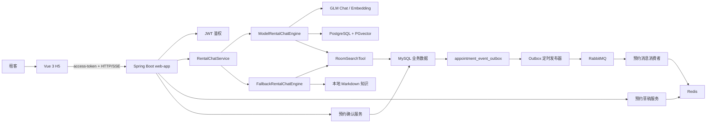
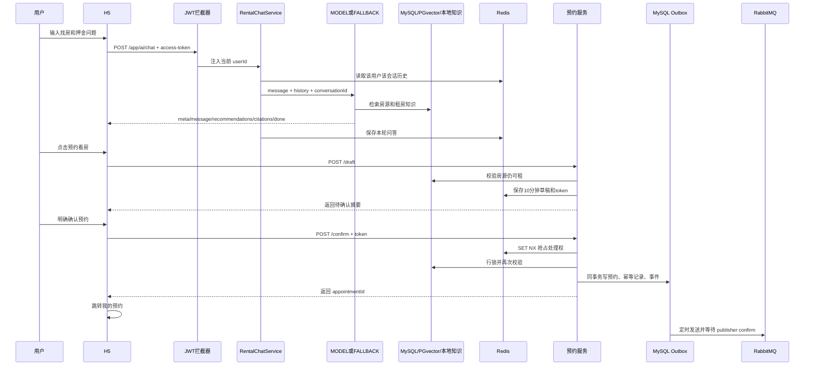

# 27公寓 AI 租房顾问闭环实现详解

> 全项目升级历史、当前七工具 Agent、MQ 落库闭环和 36 道面试追问，请先阅读 [升级改造全解与面试手册](agent-rag-mq-interview-handbook.md)。本文主体是早期实现记录。

> 版本提示：本文主体记录早期 V1 闭环，部分 MODEL/前端描述已经过时。当前 Agent Harness、混合 RAG、工具权限和最新面试口径请以 `agent-harness-explained.md`、`rag-evaluation.md` 和 `resume.md` 为准；预约与 Outbox 原理章节仍可作为补充阅读。

> 适用分支：`agentRag`
>
> 阅读目标：不阅读源代码，也能理解整个系统如何从“用户说一句找房需求”，走到“推荐真实房源、回答租房问题、生成预约草稿、明确确认预约、可靠发送预约事件、在我的预约中查到结果”。
>
> 面试原则：本文严格按照当前代码说明。已经实现的能力、仍待 Docker 运行验证的能力、演示占位能力会明确区分，避免面试时过度描述。

---

## 1. 先用一句话讲清楚这个项目

这个模块不是简单地给大模型套一个聊天页面，而是在原有公寓租赁系统上增加了一条完整、受控、可降级的 AI 业务链路：

1. 用户登录 H5，输入预算、区域以及押金等租房问题。
2. 后端优先使用 GLM + PGvector + MySQL 房源工具回答。
3. 没有模型 Key 或模型不可用时，自动切换到本地规则模式。
4. 推荐结果来自系统房源数据，不允许模型凭空编造房源。
5. 用户选择房源后，系统先生成 10 分钟有效的预约草稿。
6. 只有用户再次明确确认，才会真正写入预约表。
7. 重复点击确认不会创建重复预约。
8. 预约和待发送事件在同一个 MySQL 事务中落库。
9. RabbitMQ 暂时不可用时，事件保留在 Outbox 表中，稍后重试。
10. 确认成功后，H5 跳转“我的预约”，形成可见的业务闭环。

面试时可以把这条链路概括为：

> 我在原有租房系统上实现了一个可降级的 AI 租房顾问。模型负责理解需求和组织回答，MySQL 与确定性业务服务负责真实数据查询和预约写入。预约采用“草稿 + 明确确认”的两阶段设计，并通过幂等表、行锁和 Transactional Outbox 解决重复提交、并发确认以及数据库和消息队列一致性问题。

---

## 2. 为什么原项目需要这次改造

原项目已经有用户、公寓、房间、预约、合同等基本业务，也已经有一部分 RAG 能力，包括：

- 使用 Spring AI 对接 GLM。
- 使用 PostgreSQL + PGvector 保存向量。
- 将房源数据同步成向量文档。
- Admin 端上传租房文档到 MinIO，再解析、切片和向量化。
- 使用 `RoomSearchTool` 查询房源。
- 使用 Redis 保存聊天历史。
- 使用 SSE 返回聊天结果。

但从“简历项目”和“完整业务系统”的角度，原有能力还缺少几个关键环节：

| 原有问题 | 改造方式 |
| --- | --- |
| 没有 API Key 时 AI Bean 可能影响系统启动 | 条件装配模型 Bean，并增加本地 fallback 引擎 |
| AI 只能回答，不能形成业务结果 | 增加预约草稿、二次确认和预约结果查询 |
| 模型可能被误用来执行写操作 | 明确模型只读，预约写入由普通 Java Service 完成 |
| 用户重复点击可能创建重复预约 | Redis 短锁 + MySQL 幂等记录 + 唯一索引 |
| 数据库写成功、MQ 发送失败会丢消息 | 使用 Transactional Outbox |
| MQ 可能重复投递 | 消费端用 Redis 按事件 ID 去重 |
| 项目依赖本机已有环境，不方便复现 | 增加 Flyway、脱敏数据、Compose、健康检查和脚本 |
| AI 功能没有用户可操作页面 | 把 H5 纳入仓库并实现完整交互 |
| 缺少端到端证据 | 增加后端闭环 IT、PowerShell smoke 和 Playwright 场景 |

因此，这次改造的核心不只是“加 AI”，而是把 AI 放进真实业务边界中。

---

## 3. 先理解几个面试高频概念

### 3.1 Agent

Agent 可以理解为“能根据用户目标决定下一步做什么的 AI 应用”。

在本项目中，大模型不只生成文字，还可以在需要时调用只读工具 `RoomSearchTool`。例如用户说“预算 2500 元，想住浦东新区”，模型可以决定调用房源查询工具，再根据工具结果回答。

但这里没有让 Agent 直接写预约。原因是大模型输出具有不确定性，不能把“用户在聊天里说想看看”直接等价为一次数据库写入。

### 3.2 Tool Calling

Tool Calling 是让模型按照预先定义的参数调用普通 Java 方法。

本项目把 `RoomSearchTool.searchRooms(...)` 注册为 Spring AI 工具。工具内部最终查询 MySQL，并且只返回已发布房源。模型只能决定“是否调用”和“传什么筛选条件”，不能绕过工具直接访问数据库。

### 3.3 RAG

RAG 是 Retrieval-Augmented Generation，即“检索增强生成”。

普通大模型只依赖训练时学到的通用知识；RAG 会先从项目自己的知识库检索相关资料，再把资料和用户问题一起交给模型。这样可以减少幻觉，并让回答基于项目自己的押金、付款、维修和退租规则。

### 3.4 Embedding 与向量库

Embedding 会把一段文本转换成一组数字，也就是向量。语义接近的文本，其向量距离通常也更近。

项目使用 GLM `embedding-3`，显式指定 1024 维，并使用 PGvector 保存和检索向量。检索时采用余弦距离和 HNSW 索引。

1024 维必须在三处保持一致：

- Embedding 接口返回的向量维度。
- Spring AI `PgVectorStore` 的 dimensions。
- PostgreSQL 向量列的维度。

如果模型返回 2048 维，而数据库列是 1024 维，向量写入会直接失败。

### 3.5 SSE

SSE 是 Server-Sent Events，适合服务端持续向浏览器推送事件。

本项目使用 `POST /app/ai/chat`。因为原生 `EventSource` 只适合 GET，而且不方便发送 JSON 请求体和自定义认证头，所以 H5 使用 `fetch` + `ReadableStream` 手动解析 SSE。

### 3.6 幂等

幂等表示同一个请求执行一次和执行多次，最终业务结果相同。

例如用户连续点击两次“确认预约”，系统应该返回同一个预约 ID，而不是生成两条预约。

### 3.7 Transactional Outbox

Transactional Outbox 用来解决“数据库事务”和“消息队列发送”无法天然处于同一个本地事务的问题。

系统不在创建预约时直接依赖 MQ，而是在同一 MySQL 事务中同时写预约和 Outbox 事件。后台任务再把 Outbox 事件发送到 RabbitMQ。只要预约事务提交，事件就一定留在数据库里，可以恢复后继续发送。

---

## 4. 系统整体架构



各组件职责可以记成下面这张表：

| 组件 | 负责什么 | 不负责什么 |
| --- | --- | --- |
| H5 | 收集输入、显示事件、让用户明确确认 | 不决定业务是否可以创建预约 |
| `RentalChatServiceImpl` | 校验会话、选择引擎、保存历史、发送 SSE | 不直接查房和创建预约 |
| `ModelRentalChatEngine` | 向量检索、组装 Prompt、调用模型 | 不写业务数据库 |
| `FallbackRentalChatEngine` | 本地解析预算/区域、查 MySQL、查本地知识 | 不调用模型，不创建预约 |
| `RoomSearchTool` | 查询真实已发布房源 | 不返回未发布房源，不创建预约 |
| `AppointmentDraftService` | 校验并生成短期草稿 | 不写预约表 |
| `AppointmentConfirmationService` | 二次校验、幂等创建预约和 Outbox | 不直接依赖 MQ 成功 |
| Outbox 发布器 | 把数据库事件可靠发送到 RabbitMQ | 不创建业务预约 |
| MQ 消费者 | 处理通知，并按事件 ID 去重 | 不决定预约事务是否成功 |

---

## 5. 一次完整请求到底怎么走

下面用“预算 2500 元，并说明押金怎么退”作为例子。



这条流程中最重要的边界是：

> AI 对话只提供建议；预约必须经过独立接口和用户明确确认。模型永远不是数据库写入的最终授权者。

---

## 6. 登录和用户身份是怎么串起来的

### 6.1 为什么增加验证码策略接口

原登录逻辑把验证码生成、Redis 保存、短信发送和验证码校验都混在登录服务中。为了同时支持真实环境和可复现演示环境，改造后抽象出 `VerificationCodeService`：

- `issue(phone)`：发放验证码。
- `verify(phone, code)`：校验验证码。

系统根据配置只装配其中一个实现：

| 配置 | 实现 | 行为 |
| --- | --- | --- |
| `app.demo-login.enabled=true` | `DemoVerificationCodeService` | 只有配置的演示手机号和固定验证码有效 |
| 未配置或为 `false` | `RedisVerificationCodeService` | 生成随机验证码，发送短信并写入 Redis |

这种写法使用的是策略模式加 Spring 条件装配。`LoginServiceImpl` 不需要知道当前是演示验证码还是真实短信验证码。

### 6.2 登录成功后发生什么

1. `POST /app/login` 接收手机号和验证码。
2. `VerificationCodeService` 校验验证码。
3. 根据手机号查询 `user_info`。
4. 用户不存在时创建新用户；用户被禁用时拒绝登录。
5. 使用 `JwtUtil` 生成包含 `userId` 和用户名的 JWT。
6. H5 保存 token，后续接口放在 `access-token` 请求头中。

### 6.3 后端如何取得当前用户

`AuthenticationInterceptor` 在请求进入 Controller 前：

1. 读取 `access-token`。
2. 解析 JWT。
3. 得到 `userId` 和用户名。
4. 写入 `LoginUserHolder` 的 ThreadLocal。
5. Controller 和 Service 从 `LoginUserHolder` 获取当前用户。
6. 请求结束时清理 ThreadLocal，防止线程复用造成身份串号。

预约草稿、确认和聊天历史都使用服务端解析出的 userId，不能相信前端自己传入的 userId。

### 6.4 面试可以怎么说

> 为了兼顾演示环境和正常短信登录，我把验证码逻辑抽成策略接口，通过 `@ConditionalOnProperty` 装配固定演示验证码或 Redis 短信验证码。登录成功后签发 JWT，鉴权拦截器把 userId 放入 ThreadLocal。后续聊天和预约都从服务端上下文取用户身份，不接受客户端传 userId，避免越权。

---

## 7. AI 对话主链路

### 7.1 Controller 为什么很薄

`AiChatController` 只做三件事：

1. 暴露 `POST /app/ai/chat`。
2. 声明响应类型 `text/event-stream`。
3. 创建 `SseEmitter` 并交给 `RentalChatService`。

业务判断不放在 Controller，可以让对话逻辑独立测试，也便于未来替换传输协议。

### 7.2 为什么异步执行

模型调用和检索可能耗时。`RentalChatServiceImpl` 把任务提交给 `applicationTaskExecutor`，避免 Servlet 请求线程一直同步执行完整 AI 流程。

执行完成调用 `emitter.complete()`；异常时发送 `error` 事件，并执行 `completeWithError(...)`。

### 7.3 请求校验

服务层会检查：

- 必须有登录用户。
- 请求对象不能为空。
- 消息不能为空或全是空格。
- `conversationId` 只能包含字母、数字、下划线和短横线。
- 会话 ID 长度为 1 到 64；未传时使用 `default`。

限制会话 ID 的原因不只是格式好看，还能避免用户把特殊字符塞入 Redis Key，降低 Key 污染和不可控长度风险。

### 7.4 多用户会话隔离

聊天历史 Redis Key 是：

```text
ai:chat:history:{userId}:{conversationId}
```

同样的 `conversationId`，只要 userId 不同，Key 就不同。这样用户不能通过猜到别人会话 ID 来读取或污染别人的上下文。

每轮保存两行：

- `用户:本轮问题`
- `顾问:本轮答案`

历史只保留配置数量的最近轮次，默认 10 轮，并设置 Redis TTL，避免无限增长。

### 7.5 双引擎选择

`RentalChatServiceImpl` 同时依赖两个实现了 `RentalChatEngine` 的引擎：

- `ModelRentalChatEngine`，mode 为 `MODEL`。
- `FallbackRentalChatEngine`，mode 为 `FALLBACK`。

选择逻辑是：

1. 模型引擎存在并且 `available()` 返回 true，先尝试模型引擎。
2. 模型引擎调用成功，使用模型结果。
3. 模型 Bean 不存在、PGvector 不存在或模型执行抛出运行时异常，清空已捕获回答并调用 fallback。
4. 最终把用户问题和答案写回 Redis 历史。

这里的好处是业务调用方只依赖同一个接口，不需要在 Controller 里写大量 `if/else`。

### 7.6 SSE 事件协议

后端不会把所有内容塞成一个难以解析的字符串，而是返回结构化事件：

| 事件类型 | 作用 | H5 如何处理 |
| --- | --- | --- |
| `meta` | 告知会话 ID 和 `MODEL/FALLBACK` 模式 | 显示模型模式或降级模式 |
| `message` | 回答文本片段 | 追加到当前回答 |
| `recommendations` | 结构化房源列表 | 渲染房源卡片 |
| `citations` | 回答依据 | 渲染参考依据 |
| `done` | 本轮完成 | 结束加载状态 |
| `error` | 可展示错误 | 显示错误并保留已有内容 |

结构化事件的价值是前端不需要从大模型自然语言中用正则提取房源 ID、租金或引用。

### 7.7 当前 SSE 实现的准确边界

接口和前端都按照流式 SSE 设计，H5 也会逐事件更新页面。不过当前 MODEL 引擎调用 `ChatClient.stream()` 后使用 `collectList().block()` 收集 token，再逐条发送给 SSE。

因此准确描述应当是：

> 系统使用 SSE 结构化事件协议，前端支持增量消费；当前模型实现会先完成 token 收集再发送，不应夸大为严格的首 token 实时透传。

fallback 当前只发送一个完整 `message` 事件，然后发送推荐和引用。

---

## 8. MODEL 模式如何实现

### 8.1 模型 Bean 为什么采用条件装配

`AiModelAvailableCondition` 检查 `spring.ai.openai.api-key` 是否有内容。只有 Key 非空时，下面这些 Bean 才会创建：

- `OpenAiApi`
- `OpenAiChatModel`
- `OpenAiEmbeddingModel`
- `ChatClient`
- PGvector 相关数据源和 `VectorStore`

这意味着没有 Key 时，Spring 不会尝试初始化模型调用链，应用可以使用 fallback 启动。

### 8.2 为什么手动配置 GLM 的 OpenAI 兼容接口

GLM 提供 OpenAI 兼容协议，但 URL 路径与 Spring AI 默认 OpenAI 路径并不完全相同。

GLM 的基础地址中已经包含 `/api/paas/v4`，实际聊天和向量路径分别是：

- `/chat/completions`
- `/embeddings`

如果直接使用默认自动配置，可能拼成 `/v4/v1/chat/completions`，导致 404。因此项目手动构建 `OpenAiApi` 并明确指定路径。

### 8.3 为什么支持两个 Key

聊天和 Embedding 可以分别配置 Key：

- Chat Key 用于回答。
- Embedding Key 用于生成向量。
- 未单独配置 Embedding Key 时，回退复用 Chat Key。

这样可以适应不同账号额度或权限配置。

### 8.4 双数据源是怎么处理的

业务数据在 MySQL，向量数据在 PostgreSQL。项目显式创建：

- `dataSource`：MySQL，并标记 `@Primary`，供 MyBatis-Plus 使用。
- `pgDataSource`：PostgreSQL。
- `pgJdbcTemplate`：通过 `@Qualifier("pgDataSource")` 明确绑定 PostgreSQL。
- `VectorStore`：使用 PostgreSQL JdbcTemplate 和 EmbeddingModel 创建。

必须显式标记主数据源，因为一旦 Spring 容器中已经有第二个 DataSource，Spring Boot 默认数据源自动配置可能退避。如果不处理，MyBatis-Plus 可能拿不到 MySQL 数据源，或者把 PostgreSQL 注入到业务 Mapper。

### 8.5 一次 MODEL 查询的步骤

1. 使用用户消息执行 `VectorStore.similaritySearch(...)`。
2. 默认取 Top K 结果，并应用相似度阈值。
3. 把检索文档编号成 `[1]`、`[2]` 等上下文。
4. 拼接 Redis 中的历史问答。
5. 拼接当前用户问题。
6. 调用 `ChatClient`。
7. `ChatClient` 使用系统提示限制模型只依据资料和工具结果回答。
8. 模型可调用默认注册的 `RoomSearchTool`。
9. 返回 `meta`、回答、推荐、引用和 `done`。

### 8.6 房源知识如何进入向量库

Admin 端原有 `RoomKnowledgeServiceImpl` 会把已发布房间转换成文档。例如：

```text
公寓:27公寓张江店。上海市浦东新区张江路27号。房间号:A101。月租金:2299元。
```

同时保存元数据：

- `namespace=rooms`
- `docType=room`
- `roomRef=房间ID`
- `source=公寓名称`

房源变更时可以删除旧向量后重新写入；全量重建时先删除 `rooms` namespace，再按每批 100 条写入所有已发布房源。

### 8.7 普通知识文档如何入库

Admin 上传文档后的链路是：

1. 原始文件上传到 MinIO。
2. MySQL `ai_knowledge_doc` 保存文档元数据和状态。
3. 使用 Apache Tika 读取 PDF、Word 等文档文本。
4. 使用 `TokenTextSplitter` 分片。
5. 每个分片补充 namespace、docId、source 等元数据。
6. 调用 Embedding 模型生成向量。
7. 写入 PGvector。
8. 成功更新状态为 `INDEXED`，失败更新为 `FAILED` 并记录错误。

### 8.8 MODEL 模式的结构化推荐边界

当前结构化 `recommendations` 和房源 `citations` 主要由本轮向量检索结果中 `namespace=rooms` 的文档映射得到。虽然 ChatClient 注册了 `RoomSearchTool`，模型可以使用工具结果组织文字回答，但当前代码没有单独捕获工具调用结果并转换成推荐卡片。

另外，当前 `RoomKnowledgeServiceImpl` 写入的核心元数据是 `namespace`、`docType`、`roomRef` 和 `source`，而 `ModelRentalChatEngine` 映射推荐 DTO 时还会尝试读取 `roomNumber` 和 `rent` 元数据。房间号和租金虽然存在于文档正文中，但新写入向量的元数据并没有完整提供这两个字段。因此 MODEL 模式的结构化卡片可能拿到 roomId 和公寓来源，却缺少房间号或租金。fallback 直接查询 MySQL，不存在这个问题。

因此面试时建议准确说：

> 模型模式同时具备 RAG 和只读 Tool Calling。结构化推荐当前由检索到的房源文档映射，模型工具调用主要参与文本回答；下一步会统一房源向量元数据，并增加 Tool 回调拦截，把工具结果沉淀为同一个推荐 DTO。

---

## 9. FALLBACK 模式如何实现

### 9.1 为什么必须有 fallback

模型服务可能因为以下原因不可用：

- 没有 API Key。
- Key 额度不足。
- 网络超时。
- 供应商限流或返回 5xx。
- PGvector 或 Embedding 不可用。

如果没有 fallback，AI 模块会让整个找房演示依赖外部服务。fallback 的目标不是模仿一个完整大模型，而是保证最重要的“找房 + 租房规则 + 预约”链路仍可工作。

### 9.2 如何从自然语言提取条件

`FallbackRentalChatEngine` 使用预定义正则提取：

- 租金区间，例如 `2000-3000`、`2000到3000`。
- 最高预算，例如“预算 2500”“不超过 3000”“月租 2800”。
- 最低预算，例如“至少 2000”“最低 1800”。
- 城市，例如“上海市”。
- 区县，例如“浦东新区”“徐汇区”。

解析结果转换为 `minRent`、`maxRent`、`city` 和 `district`，再调用与模型模式共用的 `RoomSearchTool`。

### 9.3 房源查询为什么可信

`RoomSearchTool` 最终执行 MyBatis-Plus 查询：

- `is_release = RELEASED`，只返回已发布房源。
- 有最低租金时使用 `rent >= minRent`。
- 有最高租金时使用 `rent <= maxRent`。
- 有城市或区域时，先查询符合条件的公寓 ID，再过滤房间。
- 最多返回 20 条，避免无边界返回。

每条结果包含房间 ID、公寓 ID、公寓名、房间号和租金。房源数据以 MySQL 为准，不由模型或本地规则生成。

### 9.4 本地知识如何检索

项目将押金、付款、预约、报修和退租规则放在版本化文件 `ai/rag-knowledge.md` 中。

应用启动时按一级标题将 Markdown 解析为多个知识段。查询时按照关键词匹配：

- “押金、付款、月付、季付”匹配押金付款段。
- “预约、看房”匹配预约段。
- “报修、维修”匹配报修段。
- “退租、结算、违约”匹配退租段。

如果没有明确命中，则返回前两个默认知识段，避免完全没有引用。

### 9.5 fallback 返回什么

fallback 与 MODEL 使用完全相同的 SSE 外层协议：

1. `meta` 标记 `FALLBACK`。
2. `message` 说明找到多少套房，并补充最相关规则。
3. `recommendations` 返回 MySQL 房源。
4. `citations` 返回本地 Markdown 的标题、摘要和来源。
5. `done` 表示结束。

前端不需要因为后端换了引擎而换页面或换接口。

### 9.6 fallback 的能力边界

fallback 是规则引擎，不具备大模型的复杂语义理解能力。例如“我工资五千，希望房租不超过收入一半”目前无法自动计算成 2500。

同时，当前聊天历史读写依赖 Redis，`RentalChatServiceImpl` 没有捕获 Redis 异常并退化为无历史模式。因此准确状态是：

- 无模型 Key：可以 fallback。
- 模型调用失败：可以 fallback。
- Redis 整体不可用：当前聊天历史和预约草稿链路会受影响。

不能把设计目标“Redis 不可用时自动单轮聊天”说成已经完成。

---

## 10. 为什么聊天不能直接创建预约

假设用户说：“这套看起来不错，有空我想看看。”

如果让模型直接调用写数据库工具，可能出现：

- 用户只是表达兴趣，却被创建预约。
- 模型填错手机号或时间。
- 模型重复调用工具，生成多条预约。
- Prompt Injection 诱导模型绕过业务校验。
- 网络重试导致重复写入。

因此本项目采取“模型只读、写操作确定化”的原则：

- 模型和 fallback 只能查房、查知识。
- 用户必须在独立表单中填写姓名、手机和时间。
- 先生成草稿，不写预约表。
- 再次点击明确确认，才调用确认接口。
- 确认服务重新读取数据库并校验，不能只信任草稿创建时的状态。

这是本项目最值得在 Agent 开发岗位面试中强调的设计。

---

## 11. 预约草稿阶段

### 11.1 草稿接口

```text
POST /app/ai/appointments/draft
```

请求包含：

- `roomId`
- `name`
- `phone`
- `appointmentTime`
- `additionalInfo`

userId 不由前端传递，而是从 JWT 登录上下文获取。

### 11.2 草稿创建前的校验

`AppointmentDraftService` 检查：

- userId、请求和 roomId 不能为空。
- 姓名不能为空，去除首尾空格后不能超过 16 个字符。
- 手机号符合中国大陆手机号格式 `^1[3-9]\d{9}$`。
- 预约时间必须晚于当前时间。
- 备注不能超过 255 个字符。
- 房间必须存在。
- 房间必须处于已发布状态。

校验通过后才会生成草稿。

### 11.3 Token 如何生成

系统使用 `SecureRandom` 生成 32 字节随机数，也就是 256 bit 随机强度，再使用 URL 安全的 Base64 编码，并去掉末尾填充符。

这种 token 难以被猜测，且可以安全放入 JSON 和 URL 相关场景。

### 11.4 草稿保存在哪里

草稿以 JSON 保存在 Redis：

```text
ai:appointment:draft:{userId}:{token}
```

TTL 是 10 分钟。草稿内容包含服务端确认过的：

- userId
- roomId
- apartmentId
- 联系人姓名
- 手机号
- 预约时间
- 备注

把 userId 放进 Key 和草稿内容，相当于做了两层用户绑定。

### 11.5 为什么草稿阶段不写 MySQL

草稿只是“用户准备提交的内容”，还不是业务事实。如果在这一步写预约表，那么用户看到确认页面但没有点击确认，数据库里也会出现预约，违反用户预期。

闭环测试会在生成草稿后立即查询“我的预约”，断言预约数量没有变化。

### 11.6 H5 如何做到二次确认

预约面板分为两个 UI 状态：

1. 表单状态：填写姓名、手机、时间、备注，按钮是“生成预约草稿”。
2. 核对状态：展示草稿摘要和“草稿 10 分钟失效”，按钮是“明确确认预约”。

只有第二个按钮才调用 `/confirm`。按钮提交期间会进入 loading，防止前端连续点击。

---

## 12. 预约确认阶段

### 12.1 确认接口

```text
POST /app/ai/appointments/confirm
```

请求只包含 `confirmationToken`。服务端自行根据当前登录用户拼 Redis Key，并读取不可由客户端修改的草稿。

### 12.2 先查幂等记录

确认服务首先对 token 计算 SHA-256，得到固定 64 位十六进制摘要，然后查询：

```text
ai_appointment_idempotency(user_id, token_hash)
```

如果已经存在记录，直接返回原 `appointmentId`，并标记：

```text
idempotentReplay = true
```

数据库只保存 token 哈希，不保存原始 token。即使数据库记录泄露，也不能直接拿原 token 调接口。

### 12.3 Redis 如何防止同时处理

如果幂等记录还不存在，系统使用 Redis：

```text
SET ai:appointment:draft:{userId}:{token}:lock 1 NX EX 30
```

含义是：

- `NX`：只有 Key 不存在时才能设置成功。
- `EX 30`：锁 30 秒自动过期，防止服务异常后形成永久死锁。

返回状态有三种：

| 状态 | 含义 | 后续处理 |
| --- | --- | --- |
| `CLAIMED` | 当前请求获得处理权 | 进入数据库事务 |
| `PROCESSING` | 另一个请求正在处理 | 等待并读取幂等结果 |
| `MISSING` | 草稿不存在或已过期 | 返回 token 无效 |

### 12.4 为什么还要 MySQL 唯一索引

Redis 锁是第一层并发控制，但不能把最终一致性完全寄托在 Redis 上。例如锁可能过期、网络可能抖动、两个实例可能处于极端竞态。

所以 MySQL 还建立唯一索引：

```text
UNIQUE(user_id, token_hash)
```

即使两个事务都进入数据库，也只有一个能插入幂等记录。另一个遇到 `DuplicateKeyException` 后读取已创建的预约并返回。

这叫“Redis 降低冲突概率，数据库唯一约束守住最终底线”。

### 12.5 事务里为什么还要重新校验

草稿创建和用户点击确认之间最多相隔 10 分钟。这期间房间可能下架，时间可能已经不合法，用户也可能通过其他入口预约同一房间。

所以确认事务中再次检查：

- 草稿里的 userId 必须等于当前 userId。
- 预约时间仍然晚于当前时间。
- 房间仍然已发布。
- 草稿 apartmentId 与房间当前 apartmentId 一致。
- 用户不存在该房间的有效预约。

“草稿时校验一次，确认时再校验一次”属于防御性校验，避免使用过期状态。

### 12.6 为什么对房源加行锁

查询房间使用：

```sql
SELECT * FROM room_info
WHERE id = ? AND is_release = 1 AND is_deleted = 0
FOR UPDATE;
```

`FOR UPDATE` 会在当前事务内锁住这条房源记录，使并发确认在关键检查和写入阶段串行化，降低同一房源状态并发变化带来的问题。

### 12.7 一个事务写入哪些数据

`TransactionTemplate` 管理的同一个 MySQL 事务中写入三类数据：

1. `view_appointment`：真正的看房预约，初始状态为 `WAITING`。
2. `appointment_event_outbox`：待发送的预约创建事件，状态为 `PENDING`。
3. `ai_appointment_idempotency`：userId、tokenHash 和 appointmentId 的映射。

其中任何一步失败，整个事务回滚。不会出现“有预约但没有幂等记录”或“有预约但没有待发送事件”的半完成状态。

### 12.8 事务提交后 Redis 清理失败怎么办

数据库事务成功后，系统会尽力删除草稿和锁。如果 Redis 此时异常，代码只记录警告，不把已经提交的预约当成失败返回。

原因是数据库事务已经成为事实。如果此时向用户返回失败，用户重试反而更容易困惑。下次相同 token 请求会先命中 MySQL 幂等记录，仍返回原预约。

### 12.9 等待并发结果

如果另一个请求正在处理，当前请求最多轮询 40 次，每次间隔 50 毫秒，总计大约 2 秒，等待幂等记录出现。

- 查到记录：返回同一 appointmentId，并标记重放。
- 2 秒仍查不到：返回“预约正在处理中，请稍后重试”。

---

## 13. Transactional Outbox 详细实现

### 13.1 它解决的具体问题

错误写法通常是：

```text
写 MySQL 预约 -> 提交事务 -> 发送 RabbitMQ
```

如果 MySQL 已提交，但进程在发送 MQ 前崩溃，预约存在，消息永久丢失。

反过来先发 MQ 再提交 MySQL 也有问题：MQ 已收到消息，但数据库事务可能回滚，消费者会处理一条不存在的预约。

Outbox 把问题变成：

```text
同一 MySQL 事务：写预约 + 写待发送事件
事务外：反复扫描并发送待发送事件
```

MySQL 可以原子保证“预约和事件同时存在或同时不存在”。

### 13.2 Outbox 表字段

`appointment_event_outbox` 主要字段如下：

| 字段 | 含义 |
| --- | --- |
| `id` | 事件唯一 ID，也是 MQ correlation ID 和消费去重 ID |
| `aggregate_id` | 预约 ID |
| `event_type` | 当前为 `APPOINTMENT_CREATED` |
| `payload_json` | 完整预约消息 JSON |
| `status` | `PENDING`、`PUBLISHED` 或 `DEAD` |
| `attempts` | 已尝试次数 |
| `next_attempt_at` | 下次允许发送时间 |
| `published_at` | 成功发布时间 |
| `last_error` | 最近错误，最多保留 500 字符 |
| `created_at` | 创建时间 |

### 13.3 定时发布器如何工作

只有 `app.outbox.enabled=true` 时，`OutboxPublishScheduler` 才启用。

默认行为：

- 应用启动 2 秒后开始。
- 每次执行结束后等待 1 秒再执行下一批。
- 每批最多处理 20 条。

### 13.4 多实例如何避免重复抢同一批

查询使用：

```sql
FOR UPDATE SKIP LOCKED
```

含义是：

- `FOR UPDATE` 锁住当前取到的事件。
- `SKIP LOCKED` 让其他实例跳过已被锁住的记录，而不是互相等待。

领取后把 `attempts` 加一，并把 `next_attempt_at` 暂时推迟 30 秒，形成处理租约。即使当前实例中途崩溃，30 秒后事件也能再次被其他实例领取。

### 13.5 怎么确认 MQ 真的收到

发送时使用 Outbox 事件 ID 创建 `CorrelationData`，并等待 RabbitMQ publisher confirm，最长 10 秒。

只有满足以下条件才标记 `PUBLISHED`：

- Broker 返回 ACK。
- 消息没有因为路由不到队列被 Return。

如果 NACK、超时、中断或消息不可路由，则仍按失败处理，不能只因为 `convertAndSend` 没抛异常就认为成功。

这里的 `PUBLISHED` 只表示消息已经被 RabbitMQ Broker 接收并成功路由到队列，不表示消费者业务已经处理完成。如果需要准确追踪“通知已完成”，还应由消费者回写单独的消费状态或业务回执。

### 13.6 重试和 DEAD 状态

发送失败时：

- 记录错误信息。
- 按指数退避计算下一次时间。
- 最多尝试 5 次。
- 第 5 次仍失败则标记 `DEAD`。

退避思想是失败次数越多，等待越久，避免 MQ 故障时应用每秒疯狂重试。

`DEAD` 事件不会继续自动发布，需要运维排查后人工补偿或提供重放工具。当前项目还没有管理端重放页面，这是合理的后续优化点。

---

## 14. RabbitMQ 消费端如何防重复

### 14.1 为什么 MQ 消息可能重复

RabbitMQ 的常见交付语义是“至少一次”。例如消费者业务已经执行成功，但 ACK 在网络中丢失，Broker 可能再次投递同一消息。

所以生产端可靠发送并不代表消费端可以忽略幂等。

### 14.2 Redis 去重 Key

消费者使用 Outbox `eventId` 建立两类 Key：

```text
appointment:consumer:claim:{eventId}
appointment:consumer:processed:{eventId}
```

- claim 有效期 5 分钟，用于防止多个消费者同时处理。
- processed 有效期 30 天，用于跳过已经处理过的事件。

### 14.3 消费处理步骤

1. 收到预约创建消息。
2. `tryClaim(eventId)` 检查是否已经处理。
3. 未处理则获得临时 claim。
4. 执行短信通知占位逻辑。
5. 向通知队列发送通知消息。
6. 成功后写 processed Key，并删除 claim。
7. 失败时内部最多重试 3 次，每次间隔 1 秒。
8. 全部失败则释放 claim，并拒绝且不重新入原队列，由死信配置接管。

### 14.4 当前通知能力的真实状态

消费者中的“发送短信”目前只是控制台打印，注释中预留了真实短信服务调用。项目具备 MQ、重试、死信和消费幂等结构，但不能说已经真实发送预约短信。

面试时可以说：

> 消费端已经实现事件去重、有限重试和死信处理，短信调用目前使用演示适配器占位。如果接生产环境，会把打印逻辑替换为已有 `SmsService` 或独立通知服务，并补充供应商回执和补偿任务。

---

## 15. H5 前端如何消费整个链路

### 15.1 为什么不用原生 EventSource

聊天接口是带 JSON 请求体的 POST，还需要 `access-token` 请求头。原生 EventSource 不适合这个场景，因此 `streamAiChat` 使用 `fetch`：

1. 从现有 token 工具读取 JWT。
2. 设置 `Content-Type: application/json`。
3. 设置 `Accept: text/event-stream`。
4. 设置 `access-token`。
5. 从 `response.body` 获取 Reader。
6. 使用 `TextDecoder` 解码字节流。
7. 以空行分割 SSE frame。
8. 读取每个 `data:` 行并解析 JSON。
9. 按事件类型更新页面状态。

### 15.2 页面状态模型

每轮对话 `ChatTurn` 独立保存：

- 用户问题。
- 已收到的回答。
- MODEL 或 FALLBACK 模式。
- `streaming/done/error` 状态。
- 推荐房源数组。
- 引用数组。
- 错误信息。

这样即使最新请求失败，之前轮次和当前已经收到的部分内容也不会被清空。

### 15.3 如何防重复发送

发送前同时检查：

- 输入不能为空。
- `sending` 不能已经为 true。

请求期间输入框禁用、按钮显示 loading。请求结束后再恢复。

预约草稿也分别使用 `creating` 和 `confirming`，避免重复生成和重复确认。

### 15.4 房源卡片如何形成业务入口

推荐事件不是纯文字，而是渲染成 `AiRoomCard`：

- 点击卡片进入 `/roomDetail?id={roomId}`。
- 点击“预约看房”阻止卡片点击冒泡，打开预约 ActionSheet。
- 卡片显示公寓、房间号和月租。

### 15.5 确认后如何闭环

确认接口返回 `appointmentId` 后：

```text
/myAppointment?appointmentId={appointmentId}
```

页面继续使用原有预约列表接口读取当前用户预约。这样 AI 新建的预约不是停留在一个“成功 Toast”，而是进入原系统已有业务页面，可以再次查询和核对。

---

## 16. 数据库是如何在原项目基础上升级的

### 16.1 没有删除原有业务表

本次不是另起一套数据库，也没有清空本地 `lease` 库。Flyway 迁移按下面方式处理：

- V1：原有业务表结构基线，用于全新隔离数据库。
- V2：新增 AI 预约幂等表和 Outbox 表。
- V3：新增脱敏演示数据。
- V4：给原有 `view_appointment` 增加 `room_id` 和查询索引。

### 16.2 本地库与全新 Docker 库的区别

本地默认 profile：

- `baseline-on-migrate=true`
- `baseline-version=1`

含义是把本地已经存在的原业务结构登记为 V1，不重复执行 V1 建表，只执行 V2 以后增量迁移。

Docker profile：

- 面向空数据库。
- `baseline-on-migrate=false`。
- 从 V1 开始完整执行。

因此既能保护已有本地业务表，也能让全新环境从零复现。

### 16.3 新增表和字段

#### `ai_appointment_idempotency`

保存用户、token 哈希和预约 ID。唯一索引为 `(user_id, token_hash)`。

#### `appointment_event_outbox`

保存可靠消息投递状态、次数、下次重试时间和错误。

#### `view_appointment.room_id`

原预约只关联公寓，AI 推荐后需要精确预约到房间，因此增加 roomId。并增加 `(user_id, room_id, appointment_status, is_deleted)` 索引，加速重复有效预约检查。

### 16.4 演示数据

V3 使用固定高位 ID，避免与常规自增数据冲突，并使用 `ON DUPLICATE KEY UPDATE` 保证重复执行可控。

演示数据包括：

- 上海市。
- 浦东新区、徐汇区。
- 张江店、陆家嘴店、徐家汇店 3 个公寓。
- 6 个房间，其中 5 个已发布、1 个未发布。
- 2299 到 3899 不同租金。
- 月付、季付、租期、标签和图片。
- 固定演示用户。

未发布房间用于验证推荐查询不会把不可租房源返回给用户。

---

## 17. Docker Compose 为什么包含这么多服务

Compose 一共定义 9 个服务：

| 服务 | 用途 |
| --- | --- |
| MySQL | 业务数据、预约、幂等记录、Outbox |
| Redis | 验证码、聊天历史、预约草稿、锁、消费去重 |
| RabbitMQ | 预约事件和通知事件 |
| PostgreSQL + PGvector | 向量文档和语义检索 |
| MinIO | 房源图片和知识文档对象存储 |
| minio-init | 幂等创建 bucket 和演示图片 |
| web-admin | 管理端后端和知识入库能力 |
| web-app | H5 业务后端和 AI 闭环 |
| rent-house-h5 | Nginx 托管的 H5 |

基础设施都有健康检查，应用服务通过 `depends_on.condition` 等待依赖健康。H5 等待 web-app 健康后启动。

这里要注意：当前用户要求暂时不启动 Docker，所以 Compose 文件已完成静态解析，但完整运行证据仍待执行。

---

## 18. 测试如何证明这不是只写了 Happy Path

### 18.1 已通过的非 Docker 测试

最近一次验证结果：

- 后端 31 个测试通过，0 failures，0 errors。
- Maven 后端打包通过。
- H5 TypeScript 类型检查通过。
- H5 2 个 Vitest 测试通过。
- H5 生产构建通过，531 个模块完成转换。

### 18.2 对话测试覆盖

- 没有模型时使用 fallback。
- fallback 返回房源和本地知识。
- fallback 不创建预约。
- 模型上下文带编号。
- 房源向量映射为引用。
- 不同用户相同 conversationId 得到不同 Redis Key。
- 非法 conversationId 被拒绝。

### 18.3 预约测试覆盖

- 已发布房源可以生成 10 分钟草稿。
- 非法手机号被拒绝。
- 过去时间被拒绝。
- 不可用房源被拒绝。
- 确认时预约、幂等记录和 Outbox 一起写入。
- 重放返回原预约。
- 数据库已提交但 Redis 清理失败时仍返回成功。
- 过期或其他用户 token 被拒绝。
- 确认期间房源下架会被拒绝。
- 重复有效预约被拒绝。
- 确认时重新验证时间。

### 18.4 Outbox 与消费测试覆盖

- Broker ACK 后事件标记 PUBLISHED。
- Broker 故障时计算下一次重试时间。
- 第 5 次失败标记 DEAD。
- 重复事件被消费端跳过。
- 首次消费成功后写 processed 标记。
- 消费通知重试耗尽后释放 claim 并拒绝消息。

### 18.5 H5 测试覆盖

- 页面能够按事件渲染模式、房源推荐和引用。
- 创建草稿不会自动调用确认接口。
- 用户点击独立确认按钮后才调用确认。
- Playwright 已定义手机和桌面两个项目。

### 18.6 仍待 Docker 运行的测试

以下测试代码已经写好并能编译，但当前没有运行通过的容器证据：

- `AppointmentConfirmationServiceIT`：两个并发确认只创建一个预约和一个 Outbox。
- `AppointmentOutboxPublisherIT`：RabbitMQ 停止后保持 PENDING，恢复后变为 PUBLISHED。
- `RentalAgentClosedLoopIT`：真实随机端口 HTTP 完整链路。
- Compose 健康检查和 PowerShell smoke。
- Playwright 手机端和桌面端真实浏览器闭环与截图。
- 有效 GLM Key 下的 MODEL smoke。

面试时不能说“所有 Docker 端到端测试均已通过”，除非后续确实运行并更新测试报告。

---

## 19. 故障场景逐个解释

| 故障 | 当前行为 | 为什么这样设计 |
| --- | --- | --- |
| 没有 GLM Key | 不创建模型 Bean，使用 fallback | 保证应用和核心演示可运行 |
| 模型运行时异常 | `RentalChatService` 捕获后调用 fallback | 外部 AI 不应拖垮核心找房流程 |
| PGvector 未装配 | MODEL `available=false`，使用 fallback | 本地规则仍可查 MySQL |
| Redis 不可用 | 聊天历史、验证码、草稿和去重会受影响 | 当前实现未完成无 Redis 单轮聊天降级 |
| 草稿过期 | Redis 中 Key 消失，确认失败 | 避免长期有效 token 被滥用 |
| 用户拿到别人 token | userId 命名空间不同，读取不到草稿 | 防止越权确认 |
| 用户连续点击确认 | Redis claim + MySQL 唯一索引返回同一预约 | 前端防抖不能代替后端幂等 |
| 确认前房间下架 | 事务内重新查询并拒绝 | 不信任 10 分钟前的状态 |
| MQ 不可用 | 预约提交，Outbox 保持 PENDING 并重试 | 避免业务成功但消息丢失 |
| MQ ACK 丢失或重复投递 | 生产端可能重发，消费端按 eventId 去重 | 实现至少一次交付下的业务幂等 |
| 连续 5 次发布失败 | 标记 DEAD | 防止无限重试，等待人工补偿 |
| 前端聊天连接中断 | 当前轮标记错误，保留已收到内容 | 不清空用户已经看到的信息 |

---

## 20. 这套设计最值得讲的五个技术点

### 20.1 AI 与业务写入解耦

模型只负责理解和只读查询，写操作由确定性 Service 完成。这比“让模型直接调用所有业务工具”更符合真实系统的安全要求。

### 20.2 MODEL/FALLBACK 统一协议

两套引擎实现同一个接口，并产生相同 SSE 事件。前端不关心背后使用大模型还是规则引擎。

### 20.3 两阶段预约

草稿阶段不产生业务数据，明确确认阶段才写入，保证用户意图清晰，也方便服务端二次校验。

### 20.4 多层幂等与并发控制

前端 loading、Redis SET NX、MySQL 唯一索引、幂等记录和房源行锁各自解决不同层面的问题，不能只依赖其中一种。

### 20.5 Transactional Outbox

预约和事件同事务写入，MQ 恢复后继续发送；生产端确认、指数退避、DEAD 状态和消费端去重组成完整可靠消息链路。

---

## 21. 面试 30 秒版本

> 这个项目是在原有公寓租赁系统上增加 AI 找房和预约闭环。用户可以通过自然语言描述预算和区域，后端使用 Spring AI 对接 GLM，结合 PGvector 做 RAG，并通过只读 RoomSearchTool 查询 MySQL 真实房源。没有 Key 或模型异常时会切换到本地规则引擎。预约没有交给模型直接写库，而是采用 Redis 10 分钟草稿和明确确认两阶段设计，再通过 Redis 短锁、MySQL 唯一索引和幂等表防止重复预约。预约和 Outbox 事件在同一事务落库，后台确认发送 RabbitMQ，消费端按事件 ID 去重。

---

## 22. 面试 2 分钟版本

> 我做的是 27 公寓系统中的 AI 租房顾问闭环。原项目已经有房源、用户和预约等业务，我没有重写原系统，而是在现有 Spring Boot 和 Vue H5 上扩展。
>
> 对话层抽象了 MODEL 和 FALLBACK 两个引擎。MODEL 模式使用 Spring AI 对接 GLM，先从 PGvector 检索房源和租房知识，再把上下文、历史和当前问题交给模型，同时注册只读的 RoomSearchTool，让模型可以查询 MySQL 中真实已发布房源。没有 API Key、模型 Bean 不可用或调用异常时，会切换到本地规则模式，使用正则解析预算和区域，再查询同一个房源工具，并从版本化 Markdown 中匹配押金、付款、维修和退租规则。两个引擎都返回统一的 SSE 事件，所以前端不需要写两套逻辑。
>
> 写操作方面，我没有让模型直接创建预约。用户先生成 Redis 草稿，token 用 256 bit 安全随机数生成并绑定 userId，10 分钟后失效。明确确认时，系统先查 MySQL 幂等记录，再用 Redis SET NX 抢占处理权，事务内锁定房源并重新校验状态，同时写入预约、token 哈希幂等记录和 Outbox 事件。重复确认返回原 appointmentId。
>
> 为了解决 MySQL 和 RabbitMQ 一致性，使用 Transactional Outbox。后台任务用 FOR UPDATE SKIP LOCKED 批量领取事件，等待 RabbitMQ publisher confirm 后才标记 PUBLISHED，失败指数退避，最多五次后进入 DEAD。消费者再按 eventId 用 Redis 去重。最后 H5 跳到我的预约页面，能够查到刚创建的记录，形成完整闭环。

---

## 23. 面试官常见追问与回答

### Q1：为什么不用 WebSocket，而使用 SSE？

> 当前场景主要是服务端向客户端单向推送回答，客户端每轮只需要发一次 HTTP 请求，不需要长期双向通信。SSE 协议简单，天然基于 HTTP，也容易经过网关。因为需要 POST 请求体和 access-token，我没有用原生 EventSource，而是用 fetch 读取 ReadableStream 并手动解析 SSE frame。

### Q2：为什么模型不能直接创建预约？

> 大模型输出具有概率性，用户聊天表达也可能有歧义。写操作需要明确授权、参数校验、幂等和审计，所以模型只负责只读查询和建议。预约通过独立草稿接口和确认接口完成，确认时还会重新查询数据库状态。

### Q3：Redis 锁已经有了，为什么还要数据库唯一索引？

> Redis 锁用于减少并发请求同时进入事务，但分布式锁可能过期或受网络影响，不能作为最终一致性约束。MySQL 唯一索引是最终防线，即使出现极端竞态，也只允许一条 `(userId, tokenHash)` 记录。

### Q4：为什么不用直接发送 RabbitMQ？

> 数据库提交和 MQ 发送不在同一个本地事务。如果先提交数据库再发消息，进程可能在中间崩溃；如果先发消息再提交数据库，消费者可能处理不存在的预约。Outbox 让预约和事件在同一 MySQL 事务提交，再异步发送，实现最终一致性。

### Q5：Outbox 会不会重复发送？

> 会。比如 Broker 已收到但应用没有及时更新 PUBLISHED，就可能重发。因此 Outbox 只保证至少一次，消费端必须按 eventId 幂等。项目用 Redis claim 和 processed Key 去重。

### Q6：`FOR UPDATE SKIP LOCKED` 有什么作用？

> 多个应用实例扫描 Outbox 时，FOR UPDATE 锁住当前批次，SKIP LOCKED 让其他实例跳过这些记录继续取下一批，不会重复领取，也不会长时间互相阻塞。

### Q7：模型不可用如何判断？

> 启动时通过条件装配判断 API Key，只有 Key 存在才创建模型和向量 Bean；运行时模型引擎还会检查 ChatClient 和 VectorStore 是否存在，调用抛异常时由编排服务切换 fallback。

### Q8：如何防止用户串会话？

> Redis 历史 Key 同时包含服务端 JWT 解析出的 userId 和经过格式校验的 conversationId。即使两个用户使用相同 conversationId，也会落到不同 Key。

### Q9：RAG 与 Tool Calling 有什么区别？

> RAG 是先做语义检索，把相关文档作为上下文交给模型；Tool Calling 是模型根据问题决定调用一个确定性的 Java 方法。项目里 PGvector 用于检索房源和规则文档，RoomSearchTool 用于按城市、区域和预算精确查询 MySQL。

### Q10：为什么还需要 fallback，本地规则不是很弱吗？

> fallback 不是为了替代大模型全部能力，而是保证核心演示和基础业务可用。它覆盖最常见的预算、城市、区县和租房规则关键词，推荐仍来自 MySQL。复杂语义交给 MODEL，基础闭环不依赖外部模型。

### Q11：项目真的实现了流式输出吗？

> 传输协议和前端消费是 SSE 增量事件，但当前 MODEL 实现会先收集 ChatClient token，再逐条发送，所以还不是严格意义上的首 token 实时透传。进一步优化会直接订阅 Flux 并边生成边 `emitter.send`，同时处理背压、断连和超时。

### Q12：短信真的发了吗？

> 目前消费者侧是演示占位，会打印通知信息，MQ、重试、死信和幂等链路已经实现。生产接入还需要替换为真实短信适配器并处理供应商回执。

---

## 24. 可以主动说明的不足与下一步优化

主动说明边界不会减分，前提是能给出合理改进方案。

### 24.1 真正的 token 实时透传

当前 `collectList().block()` 会等待模型完成。可改为直接订阅 Flux，每收到 token 就发送 SSE，并在断连时取消订阅。

### 24.2 捕获 Tool Calling 的结构化结果

当前推荐卡片主要来自向量检索文档，并且房源向量元数据还没有完整包含推荐 DTO 所需的 roomNumber 和 rent。可先统一入库元数据，再增加 Tool 执行拦截器或 `RecommendationCollector`，把 RoomSearchTool 的真实返回直接写入 `recommendations` 事件。

### 24.3 Redis 故障降级

聊天可在 Redis 异常时退化为无历史单轮；预约草稿不能绕过 Redis，应返回服务暂不可用。消费幂等可进一步使用数据库 Inbox 表提高持久性。

### 24.4 Outbox 运维能力

增加 DEAD 事件查询、告警、人工重放、事件保留和归档任务，而不是只依赖数据库查看。

### 24.5 真实通知服务

把打印短信替换为 `NotificationService`，对接短信供应商，并记录发送状态、供应商流水号和失败原因。

### 24.6 更强的 Agent 评测

增加固定问题集，评估房源命中率、引用正确率、幻觉率、fallback 触发率、首 token 延迟和完整响应耗时。

### 24.7 权限和隐私

对聊天内容和手机号做日志脱敏，增加接口限流、token 重放监控和预约操作审计。

---

## 25. 你可以如何在简历中描述

下面的表达基于当前实现，不包含尚未完成的真实短信或 Docker 运行结论：

### 项目概述

> 面向长租公寓场景的 AI 找房与看房预约系统，基于 Spring Boot、Spring AI、Vue 3 构建，支持自然语言房源筛选、租房知识 RAG、模型故障降级、预约二次确认以及可靠事件投递。

### 技术亮点

- 基于 Spring AI 对接 GLM OpenAI 兼容接口，使用 PostgreSQL + PGvector 实现房源及租房文档语义检索，并通过 MySQL 只读 Tool Calling 保证推荐房源真实可追溯。
- 抽象 MODEL/FALLBACK 双聊天引擎，在模型缺少 Key或调用异常时，使用预算/区域规则解析、MySQL 查询和本地知识检索维持核心业务可用。
- 设计“Redis 预约草稿 + 明确确认”两阶段写入协议，结合 256 bit 随机 token、用户绑定、MySQL 唯一索引、房源行锁和幂等记录，避免越权与重复预约。
- 使用 Transactional Outbox 解决预约事务与 RabbitMQ 投递一致性，支持 publisher confirm、`FOR UPDATE SKIP LOCKED` 批量领取、指数退避、DEAD 状态和消费端事件去重。
- 使用 POST SSE 结构化传输回答、推荐房源和引用，H5 通过 Fetch Stream 解析事件，并串联房源详情、预约确认和“我的预约”结果页。
- 增加 Flyway 增量迁移、脱敏演示数据、Maven Wrapper、Docker Compose、单元/集成/E2E 测试及 smoke 脚本，提高项目可复现性。

不要写“实现真实短信通知”“Docker 全链路全部通过”或“完全实时 token 流式输出”，除非对应状态后续确实完成。

---

## 26. 最后用一张记忆卡复习

### 一条主链路

```text
登录 -> AI 对话 -> 查真实房源/知识 -> 推荐卡片
-> 预约草稿 -> 明确确认 -> 预约落库
-> Outbox -> RabbitMQ -> 我的预约可查询
```

### 两个引擎

```text
MODEL = GLM + PGvector + RoomSearchTool
FALLBACK = 正则解析 + MySQL + 本地 Markdown
```

### 三条安全边界

```text
模型只读，不直接写预约
userId 从 JWT 获取，不相信前端
预约必须草稿后再次明确确认
```

### 四层防重复

```text
前端 loading
Redis SET NX claim
MySQL 唯一索引和幂等记录
MQ 消费端按 eventId 去重
```

### 三表同事务

```text
view_appointment
ai_appointment_idempotency
appointment_event_outbox
```

### 一致性结论

```text
预约与 Outbox：MySQL 本地事务强一致
Outbox 与 RabbitMQ：重试实现最终一致
RabbitMQ 消费：至少一次 + 消费幂等
```

### 面试时最重要的一句话

> 我没有把大模型当成可以随意操作数据库的万能组件，而是把它限制在理解和只读查询层，再用确定性的业务服务、幂等控制和可靠消息机制完成真正的业务闭环。
