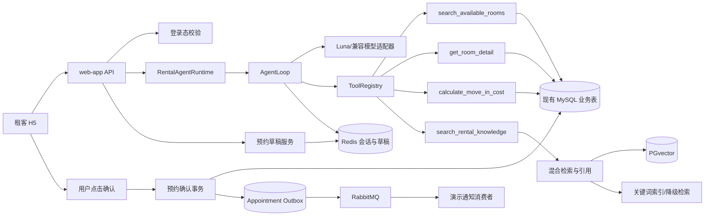

# 27公寓租房 Agent + RAG 面试版闭环规格

> 版本：v2.0-demo
>
> 规格状态：待用户批准后执行
>
> 实施分支：`agentRag`
>
> 适用范围：面试展示、项目讲解、可运行 Demo，不承诺生产级容量、合规和稳定性

## 1. 文档目的

本文档定义 27 公寓找房系统下一阶段的完整技术目标。目标不是把项目包装成“有一个聊天页面”，而是把现有业务系统、Agent 运行时和 RAG 知识库组织成一条能实际运行、能测试、能解释的闭环：

```text
租客登录
  -> 自然语言描述需求
  -> Agent 判断需要哪些工具
  -> 业务工具查询真实房源
  -> RAG 检索租房政策
  -> Agent 组织带引用的回答
  -> 用户选择房源
  -> 生成预约草稿
  -> 用户明确确认
  -> MySQL 创建一条预约 + 一条 Outbox 事件
  -> RabbitMQ 投递通知事件
  -> H5 的“我的预约”看到结果
```

这份文档参考了 `learn-claude-code` 中的 Agent Harness 思路和 `all-in-rag` 中的 RAG 全链路思路，但只选取适合当前 Java 单体项目和面试 Demo 的部分，不引入与目标无关的多智能体、MCP、Graph RAG 或复杂工作流平台。

## 2. 已确认基线

### 2.1 代码和分支边界

- 只在 `agentRag` 分支开发。
- `master` 不作为开发分支，也不进行切换或覆盖。
- 当前仓库已经存在历史实现和提交，新的设计不覆盖旧的 2026-08-03 闭环规格。
- 用户已有的 `.idea/misc.xml` 修改不属于本需求，不能暂存、提交或回滚。
- 当前本地数据库是重要基线。任何数据库变更必须先读取实际表结构和现有 Flyway 版本，再决定是否需要增量迁移。

### 2.2 当前已经存在、必须复用的能力

以下能力视为现有基础，不再另起一套同名实现：

- Java 21、Spring Boot 3.4.1、Spring AI 1.0.0。
- `RentalChatServiceImpl`、模型聊天引擎和本地 fallback 聊天引擎。
- `RoomSearchTool`，它查询 MySQL 中真实可租房源。
- Redis 会话历史。
- PGvector 第二数据源和现有知识入库能力。
- H5 的 `/app/ai/chat` SSE 对话入口及现有房源、预约页面。
- Redis 预约草稿、一次性确认令牌、预约幂等记录。
- `view_appointment`、`ai_appointment_idempotency`、`appointment_event_outbox` 相关实现。
- RabbitMQ Outbox 发布和预约结果查询路径。
- 现有的脱敏演示数据和 `rag-knowledge.md` 本地知识文件。

### 2.3 当前已知限制

这些限制在 Demo 阶段允许存在，但必须在文档和面试表述中诚实说明：

1. 当前模型路径可能在服务端聚合后再发送 SSE，因此“流式”重点是接口协议和前端渐进展示，不在本期承诺真正的首 token 延迟优化。
2. 当前部分房源知识向量的元数据不完整，房源价格和房间号的最终真值必须来自 MySQL，不能来自向量文档。
3. RabbitMQ 消费端的短信动作是演示逻辑，可以记录日志或写入通知结果，不接入真实短信资费服务。
4. 真实模型 Key、向量库和 Docker 可能在开发阶段不可用，因此必须保留 fallback 路径。
5. Demo 只覆盖单租客、单体应用和有限并发，不宣称生产级多租户、限流、审计和高可用。

## 3. 目标与非目标

### 3.1 本期目标

完成一个面试可展示的“业务 + Agent + RAG”系统：

- 能用自然语言表达预算、区域、入住偏好和租房政策问题。
- Agent 能按需选择房源查询工具和知识检索工具。
- 房源推荐必须来自现有 MySQL 业务查询，返回房间 ID、房间号、租金、公寓、区域和可租状态。
- 政策回答必须带可定位的知识引用，不能只返回无来源结论。
- Agent 可以准备预约草稿，但不能仅凭聊天内容直接写预约。
- 用户点击确认后，系统才创建预约。
- 重复确认只能得到同一个预约结果，不能产生重复记录。
- 预约和 Outbox 事件必须在同一个 MySQL 事务中提交。
- RabbitMQ 暂时不可用时，预约记录仍保留，Outbox 后续可重试。
- 没有模型 Key 时，fallback 仍能完成“找房 + 知识问答 + 草稿 + 确认 + 我的预约”闭环。
- 有效模型 Key 时，能展示真实 Agent Loop 的工具选择轨迹或结构化执行记录。

### 3.2 本期非目标

- 不自动签约、自动支付、自动扣款或自动取消合同。
- 不让模型直接执行 SQL、写 Redis 任意 key 或调用任意 HTTP。
- 不重构已有 Admin 知识管理页面。
- 不将现有业务表迁移为新表，不复制一份“AI 房源表”。
- 不引入多智能体协作、MCP 工具服务器、Graph RAG、Text2SQL、图片多模态检索或 Milvus 迁移。
- 不把真实手机号、API Key、生产数据和本地 IDE 配置提交到 Git。

## 4. 关键设计原则

### 4.1 业务真值优先

模型只负责理解用户话语、选择工具和组织语言。以下内容只能以确定性业务服务和 MySQL 结果为准：

- 房源是否存在、是否发布、是否可租。
- 房间号、租金、公寓名称和区域。
- 付款方式和预约时间校验。
- 预约创建、幂等和查询结果。

### 4.2 Agent 是受约束的运行时

Agent 不等于“把提示词发给大模型”。本期把运行时明确拆成：

```text
RentalAgentRuntime
├── AgentLoop              模型调用 -> 工具调用 -> 观察结果 -> 再调用
├── AgentContext           用户、会话、历史、当前目标和预算
├── ToolRegistry           租房领域工具注册表
├── PermissionPolicy       工具权限和用户确认边界
├── ToolHooks              调用前校验、调用后脱敏和记录
├── ContextCompactor       历史过长时压缩为摘要
├── TrajectoryRecorder     记录步骤、工具、耗时和结果摘要
└── GoalEvaluator          判断是否已经找到房源、回答知识问题或准备预约
```

### 4.3 写操作必须二次确认

对预约而言，Agent 最多生成草稿。真正写入预约表的动作由独立的确认接口完成，并且必须由当前登录用户携带有效的一次性确认令牌主动触发。这个边界是面试中说明“AI 不直接修改核心业务数据”的重点。

### 4.4 失败可降级但必须可识别

响应的 `mode` 必须明确是 `MODEL` 还是 `FALLBACK`。降级不能伪装成模型已经理解，也不能编造工具执行结果。

## 5. 总体架构



### 5.1 模块职责

| 模块 | 负责什么 | 不负责什么 |
| --- | --- | --- |
| H5 | 输入问题、展示回答、选择房源、确认预约、查看结果 | 不解析模型工具调用，不直接写业务表 |
| API 层 | 登录校验、DTO、SSE、错误转换 | 不在 Controller 中拼接复杂 Agent 逻辑 |
| Agent Runtime | 规划步骤、调用允许的工具、组织结果 | 不直接执行 SQL 和业务写入 |
| 业务工具 | 查询真实房源、详情、费用和预约草稿 | 不相信模型传入的房源真值 |
| RAG | 管理租房政策文档、检索片段、返回引用 | 不决定房源价格和可租状态 |
| 预约服务 | 校验草稿、确认令牌、事务写入和幂等 | 不接受聊天文本作为确认 |
| Outbox | 可靠投递预约事件 | 不回滚已提交的预约 |

## 6. Agent Harness 规格

### 6.1 Agent Loop

模型模式下每轮执行遵循下面的确定性循环：

```text
1. 校验当前用户和 conversationId。
2. 创建 AgentContext：用户 ID、消息、历史、当前时间和目标。
3. 将系统提示、历史、工具说明和本轮消息发送给模型。
4. 如果模型返回文本，追加回答并评估目标是否完成。
5. 如果模型返回工具调用：
   5.1 ToolRegistry 按名称查找工具。
   5.2 PermissionPolicy 判断权限。
   5.3 PreHook 校验参数、用户身份和步骤预算。
   5.4 执行确定性业务工具。
   5.5 PostHook 脱敏、截断和记录结果摘要。
   5.6 将工具结果作为 observation 追加给模型。
6. 重复 3-5，直到模型结束、目标完成、超时或达到最大步骤数。
7. 输出统一 SSE 事件，并保存有限会话历史。
```

### 6.2 工具注册表

工具名称和职责固定，工具参数必须是结构化 DTO：

| 工具 | 权限 | 输入 | 输出 | 真值来源 |
| --- | --- | --- | --- | --- |
| `search_available_rooms` | READ | 城市、区域、最高租金、入住时间、标签、数量 | 房源摘要列表 | MySQL |
| `get_room_detail` | READ | `roomId` | 房间详情、设施、付款方式、图片 | MySQL |
| `calculate_move_in_cost` | READ | `roomId`、租期、付款方式 | 月租、押金、首期应付、费用说明 | MySQL + 确定性计算 |
| `search_rental_knowledge` | READ | 问题、分类、数量 | 片段、引用、分数和版本 | PGvector + 关键词降级 |
| `create_appointment_draft` | PREPARE | 房间、时间、联系人 | Redis 草稿和确认令牌 | 预约业务服务 |

本期不把 `confirm_appointment` 暴露给模型工具注册表。确认接口属于用户显式操作，不属于 Agent 自主动作。

### 6.3 工具调用约束

- 每次对话最多执行 6 个 Agent 步骤，最多 3 次同名工具调用。
- 每个工具有独立超时，默认 3 秒；整轮对话默认 15 秒。
- 查询工具最多返回 5 条房源和 5 条知识片段。
- 工具结果只保留必要字段，手机号等敏感信息必须脱敏。
- 工具异常转换成可观察的 `tool_error`，不把堆栈和 Key 返回给前端。
- 模型要求调用未知工具、写 SQL 或跳过确认时，拒绝该动作并给出可理解的结果。

### 6.4 权限策略

```text
READ:
  允许模型调用，不产生业务副作用。

PREPARE:
  允许生成短期草稿，不创建永久预约；必须绑定当前登录用户。

WRITE:
  只能由明确的后端业务接口执行；必须通过用户确认、令牌校验和幂等保护。
```

### 6.5 上下文和轨迹

`AgentContext` 至少包含：

```json
{
  "userId": 990001,
  "conversationId": "demo-1",
  "message": "预算2500元，并说明押金怎么退",
  "history": [],
  "goal": "FIND_ROOM_AND_ANSWER_POLICY",
  "mode": "MODEL",
  "step": 0,
  "maxSteps": 6
}
```

轨迹记录只保存：步骤号、工具名、开始结束时间、成功失败、结果数量和错误分类。不能保存完整手机号、API Key 或完整模型原始请求。历史超过配置上限时，压缩为租客预算、区域、偏好、已看房源和未解决问题的摘要。

## 7. RAG 规格

### 7.1 知识内容边界

知识库只回答租房规则类问题，例如：押金退还、付款方式、入住材料、看房预约、维修报修、退租流程。房源价格和可租状态不由 RAG 决定。

### 7.2 索引生命周期

```text
Admin 上传/本地 Markdown
  -> MinIO 保存原文件（已有能力可复用）
  -> Tika 或文本解析
  -> 清洗标题、空白、重复段落
  -> 按标题层级切分
  -> 递归字符切分过长段落
  -> 补充元数据和内容 checksum
  -> embedding
  -> 写入 PGvector
  -> 更新文档状态和 chunk_count
```

每个 chunk 的逻辑元数据至少包含：

```json
{
  "chunkId": "rent-policy-v3-0007",
  "docId": 12,
  "documentName": "租房政策说明.md",
  "category": "DEPOSIT",
  "chapter": "押金",
  "section": "退还条件",
  "source": "admin-upload/rent-policy.md",
  "version": 3,
  "effectiveDate": "2026-01-01",
  "namespace": "rental-policy",
  "checksum": "sha256:..."
}
```

### 7.3 检索链路

```text
用户原问题
  -> 意图识别和查询改写
  -> 向量召回 topK
  -> 关键词召回 topK
  -> 合并、去重、过滤 namespace 和版本
  -> 简单 rerank（关键词覆盖 + 向量分数）
  -> 相似度阈值过滤
  -> 生成带 source/chapter/snippet 的 citations
```

当 PGvector 或 embedding 不可用时，使用版本化本地 Markdown 做关键词检索，返回相同的引用 DTO，并把回答模式标记为 `FALLBACK`。不能在向量不可用时静默返回“没有依据”的模型回答。

### 7.4 RAG 质量指标

Demo 阶段采用小型标注集验证，不建设独立评测平台：

- `HitRate@K`：问题对应分类是否出现在召回结果。
- `MRR`：第一条正确片段的排名。
- Context Relevance：片段是否回答当前问题。
- Faithfulness：回答中的规则是否能在引用片段中找到。
- Answer Relevance：回答是否解决用户问题。

验收最低要求：押金、付款、看房、维修和退租五类问题各准备至少 2 条测试问题；每类至少一条命中正确引用；无引用时不得声称“平台规定就是如此”。

## 8. 模型策略

### 8.1 Luna-first 目标

本阶段优先使用 `luna` 模型进行模型路径验证。由于当前项目已经采用 OpenAI 兼容接口，模型名称、Base URL 和 Key 必须配置化，不把供应商写死在业务类里：

```yaml
app:
  ai:
    model:
      primary: ${AI_CHAT_MODEL:luna}
      fallback: ${AI_CHAT_FALLBACK_MODEL:glm-4-flash}
      timeout-ms: ${AI_CHAT_TIMEOUT_MS:15000}
      max-steps: ${AI_AGENT_MAX_STEPS:6}
```

实际模型服务若不提供名为 `luna` 的 OpenAI 兼容模型，只需通过环境变量替换模型名或 Base URL，不改变 Agent、工具和 RAG 代码。当前会话本身没有可调用的模型切换接口，所以“使用 Luna”落实为项目运行配置和适配器策略，不伪造一次未发生的模型调用。

### 8.2 动态调整模型

运行时按配置选择：

1. primary 模型可用且健康检查通过，使用 primary。
2. primary 超时、限流或返回不可解析工具调用时，允许一次 fallback model 重试。
3. 两个模型都不可用时进入本地 fallback。
4. 不允许在一次对话中无限切换模型；响应记录最终 `provider` 和 `mode`。

模型切换不改变业务真值，也不改变确认边界。

## 9. API 和事件契约

### 9.1 登录

沿用现有登录接口。Demo profile 允许固定演示手机号和验证码，但必须由配置显式开启；非 Demo 环境不能让固定验证码生效。

### 9.2 AI 对话

`POST /app/ai/chat`，请求至少包含：

```json
{
  "conversationId": "demo-1",
  "message": "预算2500元，并说明押金怎么退"
}
```

保持 `text/event-stream` 和现有 `chat` 事件。事件类型：

| 类型 | 内容 |
| --- | --- |
| `meta` | conversationId、mode、provider、traceId |
| `message` | 回答文本片段 |
| `recommendations` | MySQL 房源推荐 DTO |
| `citations` | RAG 引用 DTO |
| `trajectory` | 可选的脱敏工具调用摘要 |
| `done` | 完整回答、建议动作和是否可预约 |
| `error` | 面向用户的错误分类 |

前端不依赖模型原始响应格式，只依赖这些稳定事件。

### 9.3 预约草稿

`POST /app/ai/appointments/draft`

- 校验当前登录用户、房间存在且可租、时间合法、联系人格式合法。
- Redis 保存用户隔离的草稿，TTL 10 分钟。
- 返回脱敏草稿、过期时间和一次性 `confirmationToken`。
- 该接口不写 `view_appointment`。

### 9.4 预约确认

`POST /app/ai/appointments/confirm`

- 只接收确认令牌。
- 校验令牌归属、过期、一次性消费和房源当前状态。
- 在一个 MySQL 事务中写入预约、幂等记录和 Outbox 事件。
- 同一用户重放令牌返回原预约 ID，其他用户使用该令牌失败。

## 10. 数据库和数据安全规格

### 10.1 现有表使用原则

现有 `user_info`、`apartment_info`、`room_info`、`view_appointment` 以及其它租房业务表继续使用。任何查询必须适配本地真实字段、逻辑删除字段和现有 Mapper，不复制业务表。

### 10.2 迁移规则

- 开始任何数据库任务前，先读取本地数据库的表、字段、索引和 Flyway history。
- 只允许新增编号递增的 Flyway 迁移，例如 `V5__...sql`。
- 迁移必须是向后兼容的增量操作，优先新增 nullable 字段、索引或新辅助表。
- 禁止 `DROP TABLE`、`TRUNCATE`、删除已有列、重建已有表或无条件覆盖真实业务数据。
- 演示数据必须使用独立 ID、`ON DUPLICATE KEY UPDATE` 仅更新明确的演示记录，并且不能把本地真实记录当成演示记录覆盖。
- 如果本地表结构已经满足需求，则不新增迁移；代码适配现有结构即可。
- 任何迁移在执行前后都要记录表数量、关键索引和演示数据数量，验证没有破坏已有数据。

### 10.3 Redis Key

必须包含登录用户 ID 和业务 ID：

```text
ai:chat:history:{userId}:{conversationId}
ai:appointment:draft:{userId}:{draftId}
ai:appointment:claim:{userId}:{tokenHash}
```

客户端提供的 conversationId 只允许字母、数字、下划线和短横线，长度不超过 64。

## 11. 端到端演示场景

### 11.1 无 Key fallback 场景

1. 使用 Demo 登录账号登录 H5。
2. 发送“预算 2500 元，并说明押金怎么退”。
3. fallback 识别预算，查询 MySQL 可租房源，关键词检索押金文档。
4. H5 展示真实房源和引用来源，并显示 `FALLBACK`。
5. 用户选择 `A101`，填写明天 14:00 和联系人。
6. 系统生成 Redis 草稿；检查数据库预约数量不增加。
7. 用户点击确认；创建一条预约、一条幂等记录和一条 Outbox。
8. 重复提交相同令牌；返回相同预约 ID，不新增预约。
9. 打开“我的预约”；能看到刚刚创建的预约。

### 11.2 有 Key 的 Agent 场景

1. 发送同样的混合问题。
2. 模型先调用 `search_available_rooms`，再调用 `search_rental_knowledge`。
3. 后端记录脱敏轨迹，回答中的房源来自工具结果，政策结论带 citations。
4. 后续草稿和确认链路与 fallback 完全相同。

### 11.3 必须拒绝的场景

- 用户未登录调用 AI 或预约接口。
- 模型尝试直接确认预约。
- 预约令牌过期、被其他用户使用或重复消费。
- 房源已下架或已有冲突预约。
- 使用不存在的 `roomId`。
- 问题没有命中知识库时，系统伪造政策结论。

## 12. 验收标准

以下条件全部满足才算本规格完成：

1. 只在 `agentRag` 分支存在改动，`.idea/misc.xml` 未被暂存。
2. 现有业务表未被删除、清空或重建；数据库变化全部可追踪到增量迁移。
3. 无模型 Key 时，fallback 完成登录、找房、知识引用、预约草稿、确认和我的预约。
4. 有模型 Key 时，至少有一次真实工具选择和工具结果注入模型上下文的证据。
5. 房源推荐全部能用 MySQL `roomId` 反查，不能只靠模型文本。
6. 押金等知识问题返回至少一个可定位引用，且引用内容支持答案。
7. 未经确认不能创建预约；确认后只创建一条预约。
8. 同一确认令牌并发或重放只创建一条预约。
9. 预约、幂等记录和 Outbox 在同一事务中提交。
10. RabbitMQ 暂不可用时 Outbox 保持待发布并可恢复重试。
11. 后端单元测试、迁移安全测试、API 闭环测试和 H5 构建/端到端测试有可复现命令。
12. README 和面试讲解文档能说明真实已完成内容、fallback 边界和未完成的生产化事项。

## 13. 面试表达主线

可以用下面的顺序讲解：

1. 我没有让大模型直接操作数据库，而是把房源查询、费用计算和知识检索封装成受权限控制的领域工具。
2. Agent Runtime 负责模型、工具注册、上下文、步骤上限和轨迹记录，形成一个可观察的 Agent Harness。
3. 房源是结构化业务数据，RAG 只负责租房政策，两者在回答层合并但不混淆真值来源。
4. 预约采用草稿加显式确认，确认阶段用一次性令牌和幂等表防重复。
5. 预约和 Outbox 在同一事务提交，RabbitMQ 失败时通过重试保证事件不丢。
6. 模型不可用时 fallback 仍能跑通业务闭环，因此 Demo 不依赖外部模型服务才能验收。

## 14. 批准记录

- 需求目标：待批准
- 架构方案：待批准
- 实施计划：见 `docs/superpowers/plans/2026-09-02-rental-agent-harness-rag.md`
- 代码实施：在用户批准 spec 和 plan 前禁止开始
