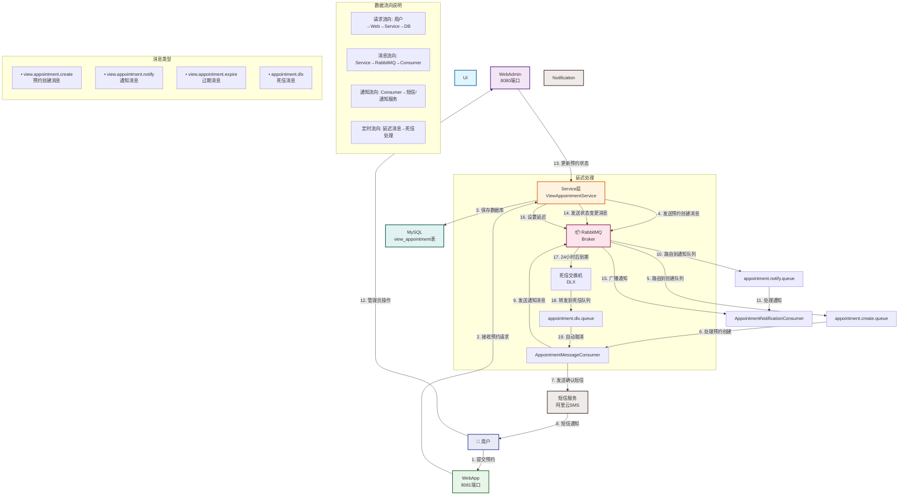

# RabbitMQ预约看房功能工作流程图



## 详细流程说明

### 1. 用户预约流程
```
用户 → 前台WebApp(8081) → Service层 → 数据库存储 → RabbitMQ消息 → 短信通知
```

### 2. 消息流转过程
```
Service层 → RabbitTemplate → Exchange → Queue → Consumer → 处理业务逻辑
```

### 3. 定时任务处理
```
Service层 → 延迟消息(24h) → 死信队列 → 自动取消未确认预约
```

### 4. 状态变更通知
```
管理员操作 → 后台WebAdmin(8080) → Service层 → 状态变更消息 → 通知相关方
```

## 关键组件说明

| 组件 | 说明 |
|------|------|
| **Exchange** | `appointment.exchange` - 预约相关交换机 |
| **Queue1** | `appointment.create.queue` - 预约创建队列 |
| **Queue2** | `appointment.notify.queue` - 通知消息队列 |
| **DLX** | `dlx.exchange` - 死信交换机 |
| **DLXQueue** | `appointment.dlx.queue` - 死信队列 |
| **Consumer1** | 预约创建消息消费者 |
| **Consumer2** | 通知消息消费者 |

## 消息队列优势

1. **异步处理**：短信发送不影响主业务流程
2. **削峰填谷**：高并发时缓冲请求
3. **可靠投递**：消息确认机制确保不丢失
4. **灵活扩展**：可轻松添加新的消息类型
5. **解耦**：服务间通过消息通信，降低耦合度